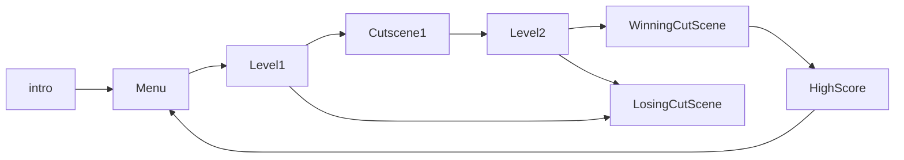
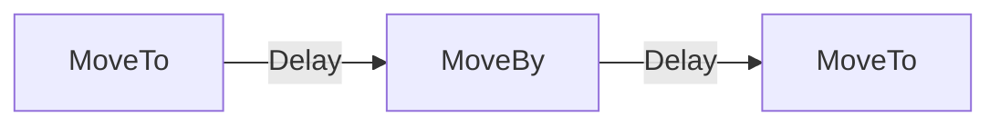

# Cocos2d-x

核心组件
- 精灵
- 动作
- 场景
- UI组件
基本概念

## Director (导演)

Director控制电影流程，知道完成各项任务。游戏设计好时，`Director`负责场景的转换

## Scene (场景)
游戏开发中，需要一个主菜单，几个管卡和一个结束场景。使用**Scene**组织这些分开的部分。

## Sprite (精灵)
所有游戏都有Sprite对象，Sprite是在屏幕上移动的对象，可以被控制。如果不能控制，则是一个节点。

## Action (动作)
Action可以让精灵在场景中移动，还可以创建一个动作序列，让精灵按照这个序列做连续的动作，在动作过程中可以改变精灵的未知，旋转角度，缩放比例等。

## Sequence (序列)
序列是多个动作按照特定顺序的一个排列

## 节点关系
Cocos2d-x的节点关系，是被附属和附属的关系。如果两个节点被添加到一个父子关系中，父节点属性变换会被自动应用到子节点。需要注意的是，不是所有的父节点属性都会被自动应用到子节点，如改变父节点的锚点只会影响转换效果(比例缩放，位置变化，角度旋转，变形等)，不会影响子节点锚点，子节点的锚点总会是左下角 (0,0)。
