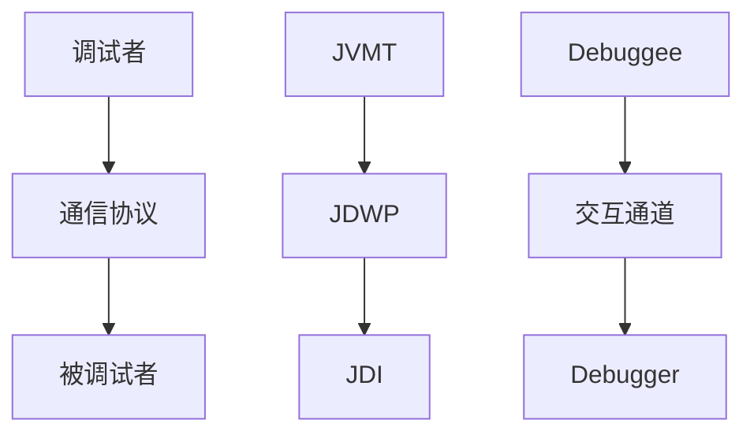

#java 
java远程调试的原理是两个VM之间通过`debug`

[[编程/java/Java]]调试体系-JPDA

参数解释
```sh
transport=dt_socket //JPDA front-end和back-end之间得传输方法，dt_socket表示使用套接字传输
address=8000 //JVM在8000端口上监听请求
server=y //y 表示启动的JVM是被调试这，如果 n则表示启动的额是调试器
suspend=u//y表示启动得JVM回暂停等待，知道调试器连接上
```

在tomcat中进行设置
找到tomcat得bin目录中得ccatalina.bat,在setlocal上面一行添加
```sh
set JPDA_OPTS=-Xdebug -Xrunjdwp:server=y,transport=dt_socket,address=8000,suspend=n
```
调试命令详解
```sh
help 查看命令列表
stop in 在方法上设置断点
stop at 在杭商设置断点
clear列出断电
stepi 不如
step up 不出
next下一行
cont下一个断点
locals查看本地变量
```

---
|name|arg1|
|----|----|
|调试者|java虚拟机工具接口 JVMT|
|通信协议|JDWP java调试线协议|
|被调试者|Java调试接口JDI|

1. 定义VM(虚拟机)的调试服务 **JVM TI(Java VM Tool Interface)**。
该组件提供了查看Java所有状态的职责。包括但不限于：JVM分析，监控，调试，线程分析，以及覆盖率分析等功能。其由JVM提供，与具体语言无关。
2. 定义调试器与调试者通信协议的 **JDWP - Java Debug Wire Protocol**。定义的主要是调试者与调试器通信时的传输信息以及请求数据格式。但不限制其传输机制。例如：有的使用socket，有的使用serial line，有的使用share money 等等。
3. Java实现的Debug Interface 接口 **JDI - Java Debug Interface**。可以理解为Java语言实现的Debug Inteface，Java程序员可以直接使用其编写远程调试工具，有很多的IDEA的远程调试功能底层就是通过调用JDI接口实现的。

## Java Dabug Interface
|package|descrption|
|-------|----------|
|com.sun.jdi|this is the core package of the jdi,it defines mirrors for values types,and the target VirtualMachine itself - as well bootstrapping facilities|
|com.sun.jdi.connect|this package defines connections between the virtual machine using the jdi and the target virtual machine|
|com.sun.jdi.connect.spi|this package comprises the interfaces and classes used to develop new TransportService implementations|
|com.sun.jdi.event|this package defines jdi events and event processing|
|com.sun.jdi.request|this package is used to request that a jdi event be sent under specified conditions|

### JDI数据模块
#### Mirror
Mirror接口时JDI最底层的接口，JDI中几乎所有其他接口都继承于它。镜像机制是将目标虚拟机上的所有数据、类型、域、方法、事件、状态和资源，以及调试器发向目标虚拟机的事件请求等都映射成 Mirror 对象。例如，在目标虚拟机上，已装载的类被映射成 ReferenceType 镜像，对象实例被映射成 ObjectReference 镜像，基本类型的值（如 float 等）被映射成 PrimitiveValue（如 FloatValue 等）。被调试的目标程序的运行状态信息被映射到 StackFrame 镜像中，在调试过程中所触发的事件被映射成 Event 镜像（如 StepEvent 等），调试器发出的事件请求被映射成 EventRequest 镜像（如 StepRequest 等），被调试的目标虚拟机则被映射成 VirtualMachine 镜像。但是，JDI 并不保证目标虚拟机上的每份信息和资源都只有唯一的镜像与之对应，这是由 JDI 的具体实现所决定的。例如，目标虚拟机上的某个事件有可能存在多个 Event 镜像与之对应，例如 BreakpointEvent 等。

Mirror 实例或是由调试器创建，或是由目标虚拟机创建，调用 Mirror 实例 virtualMachine() 可以获取其虚拟机信息，如下所示。

```java
VirtualMachine virtualMachine = mirror.virtualMachine()
```
返回的目标虚拟机对象实现了 VirtualMachine 接口，该接口提供了一套方法，可以用来直接或间接地获取目标虚拟机上所有的数据和状态信息，也可以挂起、恢复、终止目标虚拟机，这样，调试器便可以获取目标虚拟机上的信息，维持与目标虚拟机间的通信，并且检查，修改和控制目标虚拟机上资源等

PrimitiveType 包括 Java 的 8 种基本类型，ReferenceType 包括目标虚拟机中装载的类，接口和数组的类型（数组也是一种对象，有自己的对象类型）。ReferenceType 有三种子接口：ClassType 对应于加载的类，InterfaceType 对应于接口，ArrayType 对应于数组。另外，ReferenceType 还提供了一组方法，可以用来获取该类型中声明的所有变量、方法、静态变量的取值、内嵌类、运行实例、行号等信息。

PrimtiveValue 封装了 PrimitiveType 的值，它提供一组方法可将 PrimtiveValue 转化为 Java 原始数据。例如，IntegerValue 的 value () 将返回一个 int 型数据。对应地，VirtualMachine 也提供了一组方法，用以将 Java 原始数据转化为 PrimtiveValue 型数据。例如 mirrorOf(float value) 将给定的 float 数据转化为 FloatValue 型数据。

ObjectReference 封装了目标虚拟机中的对象，通过 getValue() 和 setValue() 方法可以访问和修改对象中变量的值，通过 invokeMethod() 可以调用该对象中的指定方法，通过 referringObjects() 可以获得直接引用该对象的其他对象，通过 enableCollection() 和 disableCollection() 可以允许和禁止 GC 回收该对象。

TypeComponent 接口表示 Class 或者 Interface 所声明的实体（Entity），它是 Field 和 Method 接口的基类。Field 表示一个类或者实例的变量，调用其 type() 可返回域的类型。Method 表示一个方法。TypeComponent 通过方法 declaredType() 获得声明该变量或方法的类或接口，通过 name() 获得该变量或者方法的名字（对于 Field 返回域名，对于一般方法返回方法名，对于类构造函数返回 <init>，对于静态初始化构造函数返回 <clinit>）。

**JDI链接模块**
链接是调试器与目标虚拟机之间交互的渠道，一次链接可以由调试器发起，也可以由被调试的目标虚拟机发起。一个调试器可以链接多个目标虚拟机，但一个目标虚拟机最多只能链接一个调试器。链接是由链接器（Connector）生成的，不同的链接器封装着不同的链接方式。JDI 中定义三种链接器接口，分别是依附型链接器（AttachingConnector）、监听型链接器（ListeningConnector）和启动型链接器（LaunchingConnector）。在调试过程中，实际使用的链接器必须实现其中一种接口。

根据调试器在链接过程中扮演的角色，可以将链接方式划分为主动链接和被动链接。主动链接是较常见一种链接方式，表示调试器主动地向目标虚拟机发起链接。下面将举两个主动链接的例子：

由调试器启动目标虚拟机的链接方式：这是最常见、最简单的一种链接方式。

- 调试器调用 VirtualMachineManager 的 launchingConnectors() 方法获取所有的启动型链接器实例；
- 根据传输方式或其他特征选择一个启动型链接器，调用其 launch() 方法启动和链接目标虚拟机；
- 启动后，返回目标虚拟机的实例。
- 更高级的，当目标虚拟机已处于运行状态时，可以采用调试器 attach 到目标虚拟机的链接方式：

目标虚拟机必须以 -agentlib:jdwp=transport=xxx,server=y 参数启动，并根据传输方式生成监听地址；（其中，xxx 是传输方式，可以是 dt_socket 和 share_memory）
- 调试器启动，调用 VirtualMachineManager 的 attachingConnectors() 方法获取所有的依附型链接器实例；
- 根据目标虚拟机采用的传输方式选择一个依附型链接器，调用其 attach() 方法依附到目标虚拟机上；
- 完成链接后，返回目标虚拟机的实例。
- 被动链接表示调试器将被动地等待或者监听由目标虚拟机发起的链接，同样也举两个被动链接的例子：

目标虚拟机 attach 到已运行的调试器上的链接方式：

- 调试器通过 VirtualMachineManager 的 listeningConnectors() 方法获取所有的监听型链接器实例；
- 为每种传输类型分别选定一个链接器，然后调用链接器的 startListening() 方法让链接器进入监听状态；
- 通过 accept() 方法通知链接器开始等待正确的入站链接，该方法将返回调试器正在监听的地址描述符；
- 终端用户以 -agentlib:jdwp=transport=xxx,address=yyy 参数启动目标虚拟机（其中，yyy 是调试器的监听地址）；
- 目标虚拟机会自动地 attach 到调试器上建立链接，然后返回目标虚拟机的实例。
即时（Just-In-Time）链接方式：

- 以 -agentlib:jdwp=launch=cmdline,onuncaught=y,transport=xxx,server=y 参数启动目标虚拟机；
- 虚拟机将抛出一个未捕获的异常，同时生成特定于 xxx 传输方式的监听地址，用于确立一次链接；
- 目标虚拟机启动调试器，并告知调试器传输方式和监听地址；
- 启动后，调试器调用 VirtualMachineManager 的 attachingConnectors() 方法获取所有依附型链接器实例；
- 根据指定的 xxx 传输方式，选择一个链接器；
- 调用链接器的 attach 方法依附到对应地址的目标虚拟机上；
- 完成链接后，返回目标虚拟机的实例。
Connector.Argument 是 Connector 的内嵌接口，表示链接器的一个参数，不同类型的链接器支持不同的链接器参数，LaunchingConnector 支持 home，main，suspend 等，AttachingConnector 和 ListeningConnector 支持 timeout，hostname，port 等参数，见 表 2。
常见的链接器参数
- Connector 类型	参数名称	说明
- LaunchingConnector	home	表示 java.home 的值，指向 JRE
- main	表示所要执行的 Java 类的类名
- options	表示使用的 Java 命令行参数
- suspend	表示是否在启动目标虚拟机后挂起虚拟机
- AttachingConnector
- ListeningConnector	hostname	表示被链接一端的地址
- port	表示被链接一端的端口
- timeout	表示等待链接的时间

下面将举一个简单例子，描述如何设置 main 链接参数，并启动目标虚拟机。首先，调用链接器的 defaultArguments() 获取该链接器所支持的一组默认参数
```java
Map<String,Connector.Argument> defaultArguments = connector.defaultArguments();
```
默认参数存储在一个 Key-Value 对的 Map 中，Key 是该链接器参数的唯一标识符（对终端用户不可见），Value 是对应的 Connector.Argument 实例（包括具体参数的信息和默认值）。返回的 Map 不能再新增或者删除元素，只能修改已有元素的值。

然后，从返回的 Map 中获取标识符为 main 的链接器参数
```java
Connector.Argument mainArgument = defaultArguments.get(“main”);
```
最后，将 main 参数值设置为 com.ibm.jdi.test.HelloWorld，以修改后的参数启动目标虚拟机

设置 main 参数的值并启动虚拟机
```java
mainArgument.setValue(“com.ibm.jdi.test.HelloWorld”);

VirtualMachine targetVM = connector.launch(defaultArguments);
```
### JDI 事件请求和处理模块
#### JDI 事件分类
JDI 的 com.sun.jdi.event 包定义了 18 种事件类型，如 表 3 所示。其中，与 Class 相关的有 ClassPrepareEvent 和 ClassUnloadEvent；与 Method 相关的有 MethodEntryEvent 和 MethodExitEvent；与 Field 相关的有 AccessWatchpointEvent 和 ModificationWatchpointEvent；与虚拟机相关的有 VMDeathEvent，VMDisconnectEvent 和 VMStartEvent 等。

### JDI事件请求
Event 是 JDI 中所有事件接口的父接口，它只定义了一个 request() 方法，用以返回由调试器发出的针对该事件的事件请求（EventRequest）。事件请求是由调试器向目标虚拟机发出的，目的是请求目标虚拟机在发生指定的事件后通知调试器。只有当调试器发出的请求与目标虚拟机上发生的事件契合时，这些事件才会被分发到各个事件集，进而等待发送至调试器端。在 JDI 中，每一种事件类型都对应着一种事件请求类型。一次事件请求可能对应有多个事件实例，但不是每个事件实例都存在与之对应的事件请求。例如，对于某些事件（如 VMDeathEvent，VMDisconnectEvent 等），即使没有对应的事件请求，这些事件也必定会被发送给调试器端。

另外，事件请求还支持过滤功能。通过给 EventRequest 实例添加过滤器（Filter），可以进一步筛选出调试器真正感兴趣的事件实例。事件请求支持多重过滤，通过 EventRequest 的 add*Filter() 方法可以添加多个过滤器。多个过滤器将共同作用，最终只有满足所有过滤条件的事件实例才会被发给调试器。常用的过滤器有：

线程过滤器：用以过滤出指定线程中发生的事件；
类型过滤器：用以过滤出指定类型中发生的事件；
实例过滤器：用以过滤出指定实例中发生的事件；
计数过滤器：用以过滤出发生一定次数的事件；
过滤器提供了一些附加的限制条件，减少了最终加入到事件队列的事件数量，从而提高了调试性能。除了过滤功能，还可以通过它的 setSuspendPolicy(int) 设置是否需要在事件发生后挂起目标虚拟机。

事件请求是由事件请求管理器（EventRequestManager）进行统一管理的，包括对请求的创建和删除。一个目标虚拟机中有且仅有一个 EventRequestManager 实例。通常，一个事件请求实例有两种状态：激活态和非激活态。非激活态的事件请求将不起任何作用，即使目标虚拟机上有满足此请求的事件发生，目标虚拟机将不做停留，继续执行下一条指令。由 EventRequestManager 新建的事件请求都是非激活的，需要调用 setEnable(true) 方法激活该请求，而通过 setEnable(false) 则可废除该请求，使其转化为非激活态。

### JDI事件处理
下面将介绍 JDI 中调试器与目标虚拟机事件交互的方式。首先，调试器调用目标虚拟机的 eventQueue() 和 eventRequestManager() 分别获取唯一的 EventQueue 实例和 EventRequestManager 实例。然后，通过 EventRequestManager 的 createXxxRequest() 创建需要的事件请求，并添加过滤器和设置挂起策略。接着，调试器将从 EventQueue 获取来自目标虚拟机的事件实例。

一个事件实例中包含着事件发生时目标虚拟机的一些状态信息。以 BreakpointEvent 为例：

调用 BreakpointEvent 的 thread() 可以获取产生事件的线程镜像（ThreadReference），调用 ThreadReference 的 frame(int) 可获得当前代码行所在的堆栈（StackFrame），调用 StackFrame 的 visibleVariables() 可获取当前堆栈中的所有本地变量（LocaleVariable）。通过调用 BreakpointEvent 的 location() 可获得断点所在的代码行号（Location），调用 Location 的 method() 可获得当前代码行所归属的方法。通过以上调用，调试器便可获得了目标虚拟机上线程、对象、变量等镜像信息。

另外，根据从事件实例中获取的以上信息，调试器还可以进一步控制目标虚拟机。例如，可以调用 ObjectReference 的 getValue() 和 setValue() 访问和修改对象中封装的 Field 或者 LocalVariable 等，进而影响虚拟机的行为。更多的 JDI 的事件处理的详情

## 简单的JDI例子
```
package com.ibm.jdi.test;

 

public class HelloWorld {

    public static void main(String[] args) {

        String str = "Hello world!";

        System.out.println(str);

    }

}
```
接着是一个简单的调试器实现 SimpleDebugger，清单 9 列出了实现该调试器所需要导入的类库和变量。简单起见，所有的变量都声明为静态全局变量。这些变量分别代表了目标虚拟机镜像，目标虚拟机所在的进程，目标虚拟机的事件请求管理器和事件对列。变量 vmExit 标志目标虚拟机是否中止。

```java
public class SimpleDebugger {

    static VirtualMachine vm;

    static Process process;

    static EventRequestManager eventRequestManager;

    static EventQueue eventQueue;

    static EventSet eventSet;

    static boolean vmExit = false;
}
```
随后是 SimpleDebugger 的 main() 方法，见 清单 10。首先从 VirtualMachineManager 获取默认的 LaunchingConnector，然后从该 Connector 取得默认的参数。接着，设置 main 和 suspend 参数，使得目标虚拟机运行 com.ibm.jdi.test.HelloWorld 类，并随后进入挂起状态。下一步，调用 LaunchingConnector.launch() 启动目标虚拟机，返回目标虚拟机的镜像实例，并且获取运行目标虚拟机的进程（ Process）。

然后，创建一个 ClassPrepareRequest 事件请求。当 com.ibm.jdi.test.HelloWorld 被装载时，目标虚拟机将发送对应的 ClassPrepareEvent 事件。事件处理完成后，通过 process 的 destroy() 方法销毁目标虚拟机进程，结束调试工作。
```java
public static void main(String[] args) throws Exception{
    LaunchingConnector launchingConnector = Bootstrap.virtualMachineManager().defaultConnector();
    // Get arguments of the launching connector
    Map<String, Connector.Argument> defaultArguments = launchingConnector.defaultArguments();
    Connector.Argument mainArg = defaultArguments.get("main");
    Connector.Argument suspendArg = defaultArguments.get("suspend");
    // Set class of main method
    mainArg.setValue("com.ibm.jdi.test.HelloWorld");
    suspendArg.setValue("true");
    vm = launchingConnector.launch(defaultArguments);
    process = vm.process()
    // Register ClassPrepareRequest
    eventRequestManager = vm.eventRequestManager();
    ClassPrepareRequest classPrepareRequest = eventRequestManager.createClassPrepareRequest();
    classPrepareRequest.addClassFilter("com.ibm.jdi.test.HelloWorld");
    classPrepareRequest.addCountFilter(1);
    classPrepareRequest.setSuspendPolicy(EventRequest.SUSPEND_ALL);
    classPrepareRequest.enable();
    // Enter event loop
    eventLoop();
    process.destroy();
}
```
下面是 eventLoop() 函数的实现：首先获取目标虚拟机的事件队列，然后依次处理队列中的每个事件。当 vmExit（初始值为 false）标志为 true 时，结束循环。
```java
private static void eventLoop() throws Exception {
    eventQueue = vm.eventQueue();
    while (true) {
        if (vmExit == true) {
            break;
        }
        eventSet = eventQueue.remove();
        EventIterator eventIterator = eventSet.eventIterator();
        while (eventIterator.hasNext()) {
            Event event = (Event) eventIterator.next();
            execute(event);
        }
    }
}
```
具体事件的处理是由 execute(Event) 实现的，这里主要列举出 ClassPreparEvent 和 BreakpointEvent 事件的处理用法，
SimpleDebugger 的 execute () 方法
```java
private static void execute(Event event) throws Exception {
    if (event instanceof VMStartEvent) {
        System.out.println("VM started");
        eventSet.resume();
    } else if (event instanceof ClassPrepareEvent) {
        ClassPrepareEvent classPrepareEvent = (ClassPrepareEvent) event;
        String mainClassName = classPrepareEvent.referenceType().name();
        if (mainClassName.equals("com.ibm.jdi.test.HelloWorld")) {
            System.out.println("Class " + mainClassName+ " is already prepared");
        }
        if (true) {
            // Get location
            ReferenceType referenceType = prepareEvent.referenceType();
            List locations = referenceType.locationsOfLine(10);
            Location location = (Location) locations.get(0);
            // Create BreakpointEvent
            BreakpointRequest breakpointRequest = eventRequestManager.createBreakpointRequest(location);
            breakpointRequest.setSuspendPolicy(EventRequest.SUSPEND_ALL);
            breakpointRequest.enable();
        }
        eventSet.resume();
    } else if (event instanceof BreakpointEvent) {
        System.out.println("Reach line 10 of com.ibm.jdi.test.HelloWorld");
        BreakpointEvent breakpointEvent = (BreakpointEvent) event;
        ThreadReference threadReference = breakpointEvent.thread();
        StackFrame stackFrame = threadReference.frame(0);
        LocalVariable localVariable = stackFrame.visibleVariableByName("str");
        Value value = stackFrame.getValue(localVariable);
        String str = ((StringReference) value).value();
        System.out.println("The local variable str at line 10 is " + str + " of " + value.type().name());
        eventSet.resume();
    } else if (event instanceof VMDisconnectEvent) {
        vmExit = true;
    } else {
        eventSet.resume();
    }
}
```

```sh
VM started
Class com.ibm.jdi.test.HelloWorld is already prepared
Reach line 10 of com.ibm.jdi.test.HelloWorld
The local variable str at line 10 is Hello world! of java.lang.String
```

## 参考文档
[Java Platform Debugger Architecture](https://docs.oracle.com/javase/8/docs/technotes/guides/jpda/index.html)
[JDI API文档](https://docs.oracle.com/javase/8/docs/jdk/api/jpda/jdi/index.html)
[CSDN 垃圾堆](https://blog.csdn.net/john1337/article/details/102931303)
