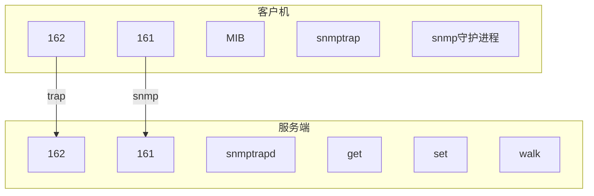

#中间件
# SNMP
SNMP(Simple Network Management Protocol)设计在TCP/IP协议簇上，为网络节点提供了一个通用的管理方法。SNMP常常会被部署在linux系统，用于管理BMC所间是的所有系统硬件资源。

## MIB介绍
连接SNMP前，需要连接MIB,MIB全称为 Management Information Base,主要负责为所有被管理的网络节点建立一个接口，本质是雷士IP地址的一串数字，：
```sh
.1.3.6.1.2.1.1.5.0
```
这串数字，每个数字都代表一个节点，含义参考表
|1|3|6|1|2|1|1|5|0|
|---|---|---|---|--|----|---|---|---|
|iso|org|dod|internet|mgmt|mib-2|system|sysName|end|

一般在下载SNMP工具包的时候还会下载一个`MIB`包，其提供了多有节点的树形结构。也可以在[OID查询网站](http://oid-info.com/get/)查找对应的替换表达。

## SNMP原理介绍
SNMP有两部分，一个是本身，专门负责管理节点。一个是Trap，用于监测告警。
SNMP可以看作是一个c/s结构。客户机中，一般会部署一个snmpd守护进程，在服务端会下载一个snmp工具包，这个包中包含了许多用于管理客户端网络节点的攻入，如get,set,translate等等。

161表示的是双方进行通信时所有的默认端口号，被管理端会打开一个守护进程，负责监听161端口发来的请求；管理端会提供一个snmp工具包，利用工具包中名列可以向被管理端的161端口发送请求包获取响应。
除此之外，管理端还会开启一个snmpTrapd守护进程，用于接受被管理端向自己162端口发送来的snmptrap请求，这一机制主要用于被管理端的自动报警中，一旦被管理端的某个节点出现故障，系统自动会发送snmptrap包，从而远端的系统固安李渊可以及时的知道问题。

## 实际运用


## 附录
[SNMP介绍及使用](https://www.cnblogs.com/chegxy/p/14020233.html)