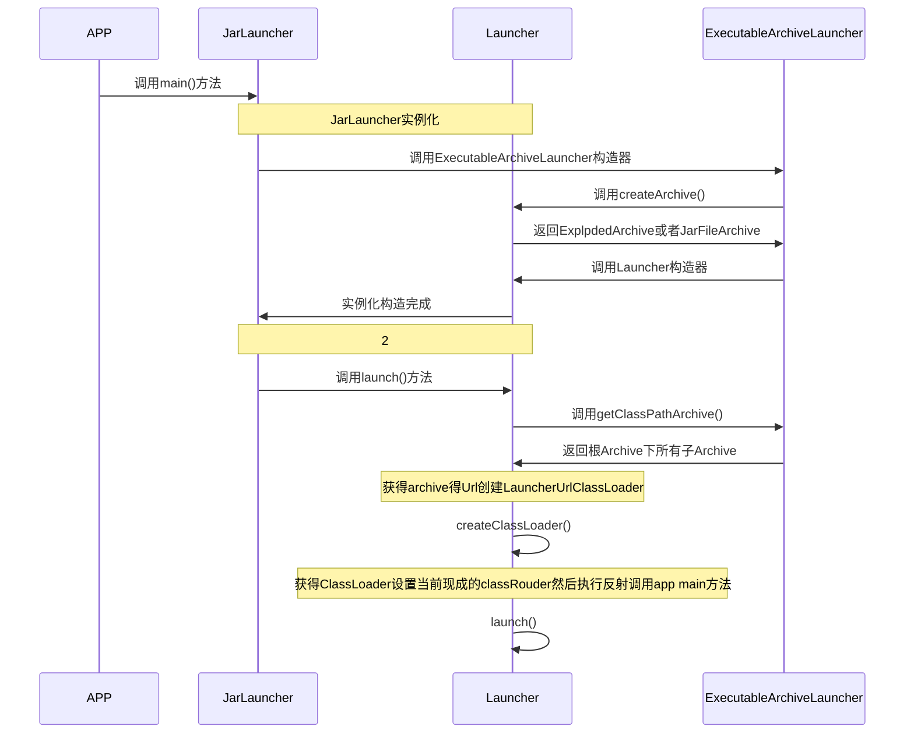

# springboot loader
#java #spring #springboot 
 
 
SpringBoot Loader 解析，相比maven-jar-plugin,用spring-boot-maven-plugin打出的包多一个BOOT-INF文件夹，例如
```sh
├── BOOT-INF
│   ├── classes
│   │   ├── application.properties
│   │   ├── co
│   │   │   └── wangming
│   │   │       └── jrc
│   │   │           └── jrcwebserver
│   │   │               └── JrcWebServerApplication.class
│   │   └── static
│   └── lib
│       ├── commons-io-2.6.jar
├── META-INF
│   ├── MANIFEST.MF
│   └── maven
│       └── co.wangming.jrc
│           └── jrc-web-server
│               ├── pom.properties
│               └── pom.xml
└── org
    └── springframework
        └── boot
            └── loader
                ├── ExecutableArchiveLauncher.class
                ├── JarLauncher.class
                ├── LaunchedURLClassLoader.class
                ├── Launcher.class
                ├── MainMethodRunner.class
                ├── archive
                ├── data
                ├── jar
                └── util
```
很明显地可以看出BOOT-INF 这个路径里放的是我们的工程依赖(lib目录)和工程源码(classes目录)。

从META-INF/MANIFEST.MF 文件中我们可以看到
```txt
Manifest-Version: 1.0
Implementation-Title: jrc-web-server
Implementation-Version: 0.1
Start-Class: co.wangming.jrc.jrcwebserver.JrcWebServerApplication
Spring-Boot-Classes: BOOT-INF/classes/
Spring-Boot-Lib: BOOT-INF/lib/
Build-Jdk-Spec: 1.8
Spring-Boot-Version: 2.2.6.RELEASE
Created-By: Maven Archiver 3.4.0
Main-Class: org.springframework.boot.loader.JarLauncher
```
真正的启动类是 org.springframework.boot.loader.JarLauncher
```java
public class JarLauncher extends ExecutableArchiveLauncher {
	static final String BOOT_INF_CLASSES = "BOOT-INF/classes/";
	static final String BOOT_INF_LIB = "BOOT-INF/lib/";
	public JarLauncher() {}

	public static void main(String[] args) throws Exception {
		new JarLauncher().launch(args);
	}
}
```
启动时序图



结合刚才的源码和上面的时序图，启动过程分为俩步

1. 构造 JarLauncher实例
2. 调用launch(args) 方法，从而反射调用我们自己应用程序里的定义的main方法。
第一步，构造JarLauncher
这一步最重要的就是要把ExecutableArchiveLauncher 里的 Archive 构建出来
```java
protected final Archive createArchive() throws Exception {
	ProtectionDomain protectionDomain = getClass().getProtectionDomain();
	CodeSource codeSource = protectionDomain.getCodeSource();
	URI location = (codeSource != null) ? codeSource.getLocation().toURI() : null;
	String path = (location != null) ? location.getSchemeSpecificPart() : null;
	if (path == null) {
		throw new IllegalStateException("Unable to determine code source archive");
	}
	File root = new File(path);
	if (!root.exists()) {
		throw new IllegalStateException(
				"Unable to determine code source archive from " + root);
	}
	return (root.isDirectory() ? new ExplodedArchive(root) : new JarFileArchive(root));
}
```
上面这一段代码是在 Launcher 这个类里，所以 getClass().getProtectionDomain() 等同于 org.springframework.boot.loader.Launcher.class.getProtectionDomain() 最终获取到的path就是spring-boot-maven-plugin 打出的fat jar的绝对路径。
**第二步，调用 launch() 方法**

构建完Launcher之后，就开始进行第二步，调用 launch(args) 方法。

这个方法是定义在了org.springframework.boot.loader.Launcher里
```java
protected void launch(String[] args) throws Exception {
	JarFile.registerUrlProtocolHandler();
	ClassLoader classLoader = createClassLoader(getClassPathArchives());
	launch(args, getMainClass(), classLoader);
}
```
首先通过调用getClassPathArchives()获取到所有的Archive，然后将所有的Archive对应的URL取到，开始创建ClassLoader

```java
protected ClassLoader createClassLoader(List<Archive> archives) throws Exception {
	List<URL> urls = new ArrayList<URL>(archives.size());
	for (Archive archive : archives) {
		urls.add(archive.getUrl());
	}
	return createClassLoader(urls.toArray(new URL[urls.size()]));
}

protected ClassLoader createClassLoader(URL[] urls) throws Exception {
	return new LaunchedURLClassLoader(urls, getClass().getClassLoader());
}
```
这段代码很简单，关键就在于 getClassPathArchives() 这个方法和 LaunchedURLClassLoader 这个类加载器内部的实现。

我们先分析以getClassPathArchives()这个方法

```java
@Override
protected List<Archive> getClassPathArchives() throws Exception {
	List<Archive> archives = new ArrayList<Archive>(
			this.archive.getNestedArchives(new EntryFilter() {
				@Override
				public boolean matches(Entry entry) {
					return isNestedArchive(entry);
				}
			}));
	postProcessClassPathArchives(archives);
	return archives;
}

@Override
protected boolean isNestedArchive(Archive.Entry entry) {
	if (entry.isDirectory()) {
		return entry.getName().equals("BOOT-INF/classes/");
	}
	return entry.getName().startsWith("BOOT-INF/lib/");
}
```
这段代码就是将根archive里面所有以BOOT-INF/classes/或者BOOT-INF/lib/开头的子archive都加载出来。

关键代码是Archive类的getNestedArchives()方法。
```java
@Override
public List<Archive> getNestedArchives(EntryFilter filter) throws IOException {
	List<Archive> nestedArchives = new ArrayList<Archive>();
	for (Entry entry : this) {
		if (filter.matches(entry)) {
			nestedArchives.add(getNestedArchive(entry));
		}
	}
	return Collections.unmodifiableList(nestedArchives);
}

@Override
public Iterator<Entry> iterator() {
	return new EntryIterator(this.jarFile.entries());
}
```

Archive接口 继承自 java.lang.Iterable 接口，因此在getNestedArchives()方法中直接对自身进行遍历。而遍历的数据源是来自org.springframework.boot.loader.jar.JarFile 这个类，它继承自java.util.jar.JarFile这个类，并对其进行类重写。

这段代码也很简单就是对从jarFile加载出来的项目进行遍历，然后调用过滤器判断是否是 以BOOT-INF/classes/或者BOOT-INF/lib/开头，如果是就添加，不是就跳过。

到目前为止，SpringBoot Loader里的 Archive 和 Launcher 就说完了。

下面开始就是对org.springframework.boot.loader.jar.JarFile的分析了

```java
public class JarFile extends java.util.jar.JarFile {
	private final RandomAccessDataFile rootFile;
	private final RandomAccessData data;
	private final JarFileType type;
	private URL url;
	private JarFileEntries entries;
	private SoftReference<Manifest> manifest;
}

private JarFile(RandomAccessDataFile rootFile, String pathFromRoot,
		RandomAccessData data, JarEntryFilter filter, JarFileType type)
		throws IOException {
	this.rootFile = rootFile;
	CentralDirectoryParser parser = new CentralDirectoryParser();
	this.entries = parser.addVisitor(new JarFileEntries(this, filter));
	parser.addVisitor(centralDirectoryVisitor());
	this.data = parser.parse(data, filter == null);
	this.type = type;
}
```
在JarFile的实例化过程中已经完成了对jar文件的解析工作了。具体的解析过程这里就不再展开了。

至此，整个SpringBoot Loader 分析工作完成。

那如果要遍历springboot fat jar里面的文件要怎么办呢？我是重新把ExecutableArchiveLauncher 和 JarLauncher 重新组合了一下，重写出一个新类
```java
class SpringBootLauncher extends Launcher {

    private static final Logger logger = LoggerFactory.getLogger(SpringBootLauncher.class);

    Map<String, SpringBootArchiveEntry> entryCache = new HashMap<>();

    static final String BOOT_INF_CLASSES = "BOOT-INF/classes/";
    static final String BOOT_INF_LIB = "BOOT-INF/lib/";

    private final Archive archive;

    public SpringBootLauncher() {
        try {
            this.archive = createJrcArchive();
        } catch (Exception ex) {
            throw new IllegalStateException(ex);
        }
    }

    private Archive createJrcArchive() throws Exception {
        Class<?> launcherClass = Class.forName("org.springframework.boot.loader.Launcher");
        ProtectionDomain protectionDomain = launcherClass.getProtectionDomain();
        CodeSource codeSource = protectionDomain.getCodeSource();
        URI location = (codeSource != null) ? codeSource.getLocation().toURI() : null;
        String path = (location != null) ? location.getSchemeSpecificPart() : null;
        if (path == null) {
            throw new IllegalStateException("Unable to determine code source archive");
        }
        File root = new File(path);
        if (!root.exists()) {
            throw new IllegalStateException("Unable to determine code source archive from " + root);
        }
        return (root.isDirectory() ? new ExplodedArchive(root) : new JarFileArchive(root));
    }

    @Override
    protected String getMainClass() throws Exception {
        Manifest manifest = this.archive.getManifest();
        String mainClass = null;
        if (manifest != null) {
            mainClass = manifest.getMainAttributes().getValue("Start-Class");
        }
        if (mainClass == null) {
            throw new IllegalStateException("No 'Start-Class' manifest archiveEntry specified in " + this);
        }
        return mainClass;
    }

    @Override
    protected List<Archive> getClassPathArchives() throws Exception {
        List<Archive> archives = new ArrayList<>(this.archive.getNestedArchives(this::isNestedArchive));
        postProcessClassPathArchives(archives);

        logger.info("entryCache.size : {}", entryCache.size());
        return archives;
    }

    protected void postProcessClassPathArchives(List<Archive> archives) throws Exception {
        for (Archive archive : archives) {

            Iterator<Archive.Entry> ite = archive.iterator();
            while (ite.hasNext()) {
                Archive.Entry archiveEntry = ite.next();

                SpringBootArchiveEntry entryItem = new SpringBootArchiveEntry();
                entryItem.archiveEntry = archiveEntry;
                entryItem.archive = archive;
                entryCache.put(archiveEntry.getName(), entryItem);
            }

            postProcessClassPathArchives(archive.getNestedArchives(this::isNestedArchive));
        }
    }

    public List<SpringBootArchiveEntry> getEntries(String path) {
        List<SpringBootArchiveEntry> list = new ArrayList<>();
        for (Map.Entry<String, SpringBootArchiveEntry> stringEntryItemEntry : entryCache.entrySet()) {
            if (stringEntryItemEntry.getKey().startsWith(path)) {
                list.add(stringEntryItemEntry.getValue());
            }
        }
        return list;
    }

    protected boolean isNestedArchive(Archive.Entry entry) {
        if (entry.isDirectory()) {
            return entry.getName().equals(BOOT_INF_CLASSES);
        }
        return entry.getName().startsWith(BOOT_INF_LIB);
    }

    @Override
    protected void launch(String[] args, String mainClass, ClassLoader classLoader) throws Exception {
        Thread.currentThread().setContextClassLoader(classLoader);
    }

    public void launch() throws Exception {
        super.launch(new String[]{});
    }
}
```
在postProcessClassPathArchives(archives); 这个方法中将所有的entry都缓存了下来。方便后期我遍历或者查询使用