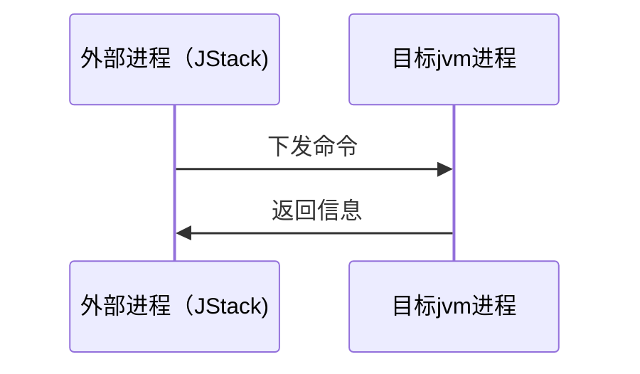

# java体系知识

## 中间件

### mybatis

1. 字段类型映射

| 数据库字段    | mybatis                    |
| ------------- | -------------------------- |
| CHAR          | String                     |
| VARCHAR       | String                     |
| LONGVARCHAR   | String                     |
| NUMERIC       | BigDecimal                 |
| DECIMAL       | BigDecimal                 |
| BIT           | boolean                    |
| BOOLEAN       | boolean                    |
| TINYINT       | byte                       |
| SMALLINT      | short                      |
| INTEGER       | int                        |
| BIGINT        | long                       |
| REAL          | float                      |
| FLOAT         | double                     |
| DOUBLE        | double                     |
| BINARY        | byte[]                     |
| VARBINARY     | byte[]                     |
| LONGVARBINARY | byte[]                     |
| DATE          | java.sql.Date              |
| TIME          | java.sql.Time              |
| TIMESTAMP     | java.sql.Timestamp         |
| CLOB          | Clob                       |
| BLOB          | Blob                       |
| ARRAY         | Array                      |
| DISTINCT      | mapping of underlying type |
| STRUCT        | Struct                     |
| REF           | Ref                        |
| DATALINK      | java.net.URL               |

#### mybatis有意思的问题

> 记录一些遇到的有意思的问题

```sql
update tablex set t = 200 and id =1 ## 结果是 tablex.t = 1 or 0
```

## java基础

int 4个字节float4个字节但是

```kotlin
Float.MAX_VALUE>Int.MAX_VALUE
```

因为`float`精度没有Int高，有数据缺失

## ClassLoader

`java`默认使用**双亲委派机制**

> 类夹在某个.class文件，首先把这个人物委托给他的上级类加载器，递归，如果上级的类加载器没有加载，自己才会去加载这个类。

### 类加载器类别

- BootstrapClassLoader（启动类加载器）负责加载 `JAVA_HOME/lib`目录中的类库

- ExtClassLoader（标准扩展类加载器）负责加载`JAVA_HOME/lib/ext`目录中的类库

- AppClassLoad （系统类加载器）负责加载用户路径（classpath）上的类库

- CustomClassLoad（用户自定义类加载器）

  ```mermaid
  graph LR
  	A(CustomClassloader)
  		A2(CustomClassloader)
  	B(AppClassLoader)
  	C(Extclassloader)
  	D(BootstrapClassloader)
  	A-->B
  	A2-->B
  	B-->C
  	C-->D
  ```

# 深入理解JVM虚拟机

## 内存管理

### 运行时数据区域

根据java1.7版本的虚拟机规范，java虚拟机包括一下几个运行时数据区


### 程序计数器

程序计数器是一块较小的内存空间，可以看作房钱县城所执行的字节码的行好只是起。分支，循环，跳转，异常处理，线程回恢复等等都依赖于计数器完成。

每个线程拥有独立的计数器，互相不影响，独立存储。

执行`java`方法的时候计数器记录的是虚拟机字节码指令的地址，如果执行的是`Native`方法，那么计数器则为空（Undefined）。该内存区域是唯一一个在`java虚拟机`规范中没有规定任何`OutOfMemoryError`情况的区域。

### 虚拟机栈

和程序计数器一样`java virtual machine stacks`也是线程私有的，它的生命周期和线程相同。虚拟机栈描述的是java方法执行的内存模型:每个方法在执行的同时都会创建一个帧栈（stack frame）用来存储局部变量表，操作数栈，动态链接，方法出口等信息。每一个方法从调用直至执行完成，都对应着一个栈帧在虚拟机中入栈到出栈的过程。

常规把java内存去分为堆内存和栈内存的方法过于粗糙，实际上的区域划分更加复杂。

局部变量表存放了编译期可知的各种基本类型（boolean,byte,char,short,int,float,long,double），对象引用（reference类型，它不等同于对象本省，可能是一个指向对象起始地址的引用指针，也可能是指向一个代表对象的句柄或其他与此对象县官的位置）和returnAddress类型。

64位长度的long和double类型会占用两个局部变量空间（Slot）,其余的数据类型占用一个。进入一个方法的时候，局部表量表的打小就是确定的，运行期间不会在改变。

Java虚拟机规范中对这个区域规定了两种异常状况：如果线程请求的栈深度大于虚拟机所允许的深度，将会抛出`StackOverFlowError`异常。如果虚拟机栈可以动态扩展，扩展时无法申请足够内存，会抛出`OutOfMemoryError`异常。

总空间一定的情况下，局部变量表内容越多，栈帧越大，栈深度越小。进行大量递归的时候就有可能导致栈溢出。

### 本地方法栈

本地方法栈(Native Method  Stack)和虚拟机栈作用很相似，两者区别是后者为Java方法（字节码）服务，前者则为虚拟机使用到的Native方法服务。有的虚拟机就干脆合二为一（Sun HotSpot虚拟机），本地方法栈可能抛出的异常也是上面那两个。

### java堆

对于多数应用来说，Java堆（Java  Heap）是Java虚拟机管理的最大一块内存。Java堆被所有线程共享，在虚拟机启动的时候创建。此内存区域的唯一目的就是存放对象实例。Java虚拟机规范中规定所有的对象实例和数组都要在堆上分配，但是随着发展，现在变得并不这么绝对。

Java堆内存是`垃圾收集管理器管理的主要区域`，所以也成为GC堆。从内存回收的角度来看，现代收集器都采用分代收集算法，所以Java堆还可以细分为：新生代和老年代。再细致一点有Eden空间、From Survivor空间、To Survivor空间。

Java堆可以处在物理不连续的内存空间上，只要逻辑连续即可。

### 方法区

方法区（Method Area）也是所有线程共享的内存区域，用于存储虚拟机加载的类信息、常量、静态变量、即时编译器编译的代码等数据。也称作Non-Heap非堆内存。

Java虚拟机规范堆方法区的限制非常宽松，可以选择不实现垃圾收集，但是这部分区域的回收确实是有必要的。

平时，说到永久带(PermGen space)的时候往往将其和方法区不加区别。这么理解在一定角度也说的过去。因为，《Java虚拟机规范》只是规定了有方法区这么个概念和它的作用，并没有规定如何去实现它。那么，在不同的 JVM 上方法区的实现肯定是不同的了。

同时，大多数用的JVM都是Sun公司的HotSpot。在HotSpot上把GC分代收集扩展至方法区，或者说使用永久代来实现方法区。

在JDK1.8及以后版本，永久带被移除，新出现的元空间（Metaspace）替代了它。元空间属于Native Memory Space

在1.8中，可以使用如下参数来调节方法区的大小

- XX:MetaspaceSize 元空间初始大小
- XX:MaxMetaspaceSize 元空间最大大小   超过这个值将会抛出OutOfMemoryError异常:java.lang.OutOfMemoryError: Metadata space

### 运行时常量ci

运行时常量池（Runtime Constant  Pool）是方法区的一部分。Class文件中除了有类的版本、字段、方法、接口等描述信息外，还有一项信息是常量池（Constant Pool  Table），用于存放编译期生成的各种字面量和符号引用，这部分内容在类加载后进入方法区的运行时常量池中存放。

Java虚拟机堆Class文件的每一部分格式都有严格要求，要符合要求才能被虚拟机认、装载和执行。但是对于运行时常量池，Java虚拟机规范没有做任何细节要求。另外运行时常量池的一个重要特征就是具有动态性，运行期间可一个将新的常量放入池中 ，这种特性被开发人员利用得比较多的便是String类的`intern()`方法

### 直接内存

直接内存（Direct Memory）不是虚拟机运行时数据区的一部分，也不是虚拟机规范中定义的内存区域，但是也被频繁使用，也有可能导致`OutOfMemoryError`异常出现。

在JDK1.4中新加入的NIO类，引入了基于通道与缓冲区的I/O模式，可以使用Native函数库直接分配堆外内存，然后通过存储在Java堆中的`DirectByteBuffer`对象作为内存的引用进行操作。

这部分内存不受到Java堆大小的限制，但是仍然收到本机内存空间和处理器寻址空间的限制，也有可能出现`OutOfMemoryError`异常。

## 对象创建过程

### 类加载

虚拟机遇到一条new指令的时候，会首先检查指令的参数是否能在常量池中定位到一个类的符号引用，并且检查这个符号引用代表的类是否被加载、解析和初始化过。如果没有，就限制性类加载过程。这个部分后续讨论。

### 分配内存

类加载检查完成之后，虚拟机会对新的对象分配内存。对象所需的内存大小在类加载完成之后就可以完全确定，为对象分配空间的任务等同于把一块确定大小的内存从堆内存中划分出来，这里有两种划分方式：

- 如果内存绝对规整，分配内存就是把指针向后移动与对象大小相等的距离。这种方法叫做指针碰撞（Bump the Pointer）
- 如果堆中的内存不是规整的，已经使用的和空闲的内存相互交错，分配的时候就需要找到一块足够大的空间划分给对象实例，并维护一个列表记录地址。

堆内存是否规整是由`垃圾收集器`是否带有`压缩整理`功能决定的

除此之外，还需要考虑的是对象创建中线程安全的问题，假如两个线程同时移动内存指针，就有可能出现错误，解决这个问题也有两个方案：

- 使用CAS搭配失败重试的方式保证更新操作的原子性。
- 或者把内存的分配动作按照线程划分在不同的空间之中进行，即每个线程在堆中预先分配一小块内存，成为本地内存分配缓冲区（Thread Local Allocation Buffer，TLAB），虚拟机是否启用TLAB可以用参数`-XX:+/-TLAB`来设定。

### 初始化信息

内存分配完成后，虚拟机需要将分配到的内存空间都初始化为零值（不包括对象头），如果使用TLAB，这一工作过程也可以提前至TLAB分配时进行。这一操作保证了对象的实例字段在Java代码中可以不赋初值就直接使用。

然后，虚拟机需要对对象进行必要的设置，例如这个对象是哪个类的实例、如何才能找到类的元数据信息、对象的哈希码、对象的GC分代年龄等信息。这些信息存放在对象的对象头（Object Header）中，根据虚拟机当前的运行状态不同，比如是否启用偏向锁等，对象头会有不同的设置方式。

从虚拟机的视角，一个新的对象已经产生，但是从Java程序的视角来看，对象创建才刚刚开始，init方法还没执行，所有字段还都为零。所以，执行new指令之后会接着执行init方法，把对象按照程序员意愿进行初始化。

### 对象的内存布局

在HotSpot虚拟机中，对象可以分为三个区域：`对象头（Header）`、`实例数据（Instance Date）`和`对齐填充（Padding）`。

#### 对象头

HotSpot虚拟机的对象头包括两部分信息：

- 对象自身的运行时数据，如哈希码、GC分代年龄、锁状态标志、线程持有的锁、偏向线程ID、偏向时间戳等，这部分数据在32位和64位虚拟机上分别为32bit和64bit，官方称它为“Mark Word”。当对象需要存储的运营时数据很多时，它会根据对象的状态复用自己的存储空间。
- 类型指针，即对象指向它的类元数据的指针，虚拟机通过这个指针来确定这个对象是哪个类的实例。
- 如果对象是一个Java数组，那在对象头中还必须有一块记录数组长度的数据，因为虚拟机可以通过普通Java对象的原数据确定Java对象的大小，但是从数组的原数据中却无法确定。


#### 实例数据

实例数据是对象真正存储的有效信息，也就是在程序代码中所定义的各种类型的字段信息，无论从父类继承下来的，还是在子类中定义的，都需要记录起来。这部分的存储顺序收到虚拟机分配策略参数和在源码中定义的顺序影响。

#### 对象填充

这部分不是必然存在，没有特殊的含义，仅仅起着占位符的作用。HotSpot VM的自动内存管理系统要求对象其实地址必须是8字节的整数倍，因此当对象实例数据部分没有对齐的时候，就需要通过对齐填充来补全。

#### 对象的访问定位

对象建立之后，Java程序需要通过栈上的reference数据来操作堆上的具体内容。由于reference类型在Java虚拟机规范中之规定了一个指向对象的引用，并没有定义这个引用应该如何定位、访问堆中对象的具体位置，所以对象访问方式取决于虚拟机如何实现，当前主流有使用句柄和直接指针两种。

- 使用句柄访问的话，Java堆中会单独划分一部分区域作为句柄池，reference中存储的就是对象的句柄地址，而句柄中包含了对象实例数据和类型数据各自的具体地址信息。


- 如果使用直接指针访问，那么Java对对象的布局中就必须考虑如何放置访问类型数据的相关信息，而reference中存储的直接就是对象地址。

  

这两种方式各有优势，使用句柄的好处是reference中存储的是稳定的句柄地址，在对象被移动时只会改变句柄中的实例数据指针，而reference本身不需要修改。

使用直接指针的最大好处是速度更快，节省了一次指针定位的开销。HotSpot使用的是第二种方式。

### 垃圾收集器和内存分配策略

#### 概述

垃圾收集出现的时间远比Java要早，从出现起，垃圾收集就需要考虑三个问题：

- 哪些内存需要回收
- 什么时候回收
- 如何回收

在Java内存运行时区域里，程序计数器、虚拟机栈、本地方法栈随线程而生，随线程而灭；栈中的栈帧随着方法的进入和退出有条不紊的进行出栈和入栈操作。每个栈帧中分配的内存基本是在类结构确定下来的时候就是已知的。Java堆和方法区不一样，只有在运行时才知道创建那些对象，所以这部分内存的分配和回收都是动态的，垃圾收集器所关注的也是这部分内存。

#### 那些内存需要回收

##### 引用计数法

引用计数器法是这样的：给对象添加一个引用计数器，每当有一个地方引用它时，计数器+1，引用失效的时候，计数器-1，任何时刻计数器为0的对象就不可能再被使用。

主流的Java虚拟机中没有选用这个方法来管理内存的，最主要的原因是很难解决对象循环引用的问题。

##### 可达性分析

主流的商用程序语言的主流实现中，都是通过可达性分析（Reachability  Analysis）来判定对象是否存活的。这个算法的基本思路是通过一系列的成为“GC  Roots”的对象作为起始点，从这些节点开始向下搜索，搜索所走过的路径称之为引用链（Reference Chain），当一个对象到达GC  Roots没有任何引用链相连时，证明此对象不可用。

##### 引用类型

无论通过计数器，还是通过可达性分析，判断对象是否存活都与“引用”有关。在JDK1.2之后，Java对引用状态进行了扩充，将引用分为强引用（Strong Reference）、软引用（Soft Reference）、弱引用（Weak Reference）、虚引用（Phantom  Reference）4种，这4种引用强度依次逐渐减弱。

- 强引用就是指在代码中普遍存在的，类似于`Object obj=new Object()`这类引用，只要强引用还存在，垃圾收集器就永远不会回收被引用的对象。
- 软引用用来描述一些还有用但是不必须的对象。在系统将要发生内存溢出异常之前，将会把这些对象列进回收范围之内进行二次回收。如果这次回收之后还是没有足够内存，才会抛出内存溢出异常。
- 弱引用也是用来描述非必须对象达到，但是它的强度比软引用更弱一些，被弱引用关联的对象只能生存到下一次垃圾回收发生之前。当垃圾收集器工作的时候，无论当前内存是否充足，都会回收掉被弱引用关联的对象。
- 虚引用也称为幽灵引用或者幻影引用，是最弱的一种引用关系。一个对象是否有虚引用的的存在，完全不会对其生存时间构成影响，也无法通过虚引用来取得一个对象实例。为一个对象设置虚引用的唯一目的就是在这个对象被垃圾回收的时候收到一个系统通知。

##### 生存还是死亡

即使在可达性分析算法中不可达的对象，也不是必定被回收，他们暂时处于“缓刑”阶段。要真正宣告一个对象死亡，至少要经历两次标记过程：第一次在可达性分析中发现没有引用链，会被标记并且进行筛选，筛选条件条件是此对象是否有必要执行`finalize()`方法。当对象没有覆盖`finalize()`方法或者已经被虚拟机调用过，虚拟机将这两种情况视为“没有必要执行”。

如果有必要执行，对象会被放置在一个叫F-Queue的队列中，稍后由一个虚拟机建立的、低优先级的Finalizer线程去执行。这个“执行”是指虚拟机触发这个方法，但是不承诺等待执行完毕。`finalize()`方法是对象逃脱死亡的最后一次机会，如果对象要在其中拯救自己，那么与任何一个引用链上的对象建立关联即可。如果建立的关联，比如将自己赋值给了某个类变量，那么第二次标记的时候就会被移除“即将回收”的集合。

#### 垃圾收集算法

##### 标记-清除算法

最基础的算法是“标记-清除”（Mark-Sweep）算法，如名字一样，算法分为“标记”和“清除”两个阶段：首先标记需要回收的对象，然后统一回收。他是最基础的收集算法，但是主要有两点不足：

- 效率问题，标记和清除效率都不高
- 空间问题，标记清除之后会有大量的不连续内存碎片，空间碎片太多导致后续分配大对象内存的时候，无法找到足够的连续内存而不得不触发另一次垃圾收集动作。

##### 复制算法

复制算法提高了效率，他可以将内存按照容量划分为大小相等的两块，每次使用其中一块。当一块的内存用完之后，把存活的对象移动到另一块，然后把已经使用的空间一次性清理掉。这个方式实现简单运行高效，但是代价是内存缩小为原来的一半。

现在的商业虚拟机都是采用这种收集算法来回收新生代，由于98%的对象都是“朝生夕死”的，所以不需要1:1的比例划分内存空间，而是划分一块较大的Eden和两块较小的Survivor空间，每次使用Eden和其中一块Survivor。回收的时候，将Eden和Survivor中还存活的对象一次性复制到另一块Survivor中，然后清理掉Eden和使用的Survivor空间。HotSpot虚拟机中默认的Eden和Survivor空间比例划分是8:1。但是，98%的对象可回收只是一般场景下的数据，我们不能保证每次回收都是这样，所以当Survivor空间不够使用时，需要依赖其他内存（这里指老年代）进行分配担保（Handle Promotion）。

当一块Survivor空间中没有足够的空间存放上一次新生代收集下来的存活对象的时候，这些对象会直接通过分配担保机制进入老年代。 

##### 标记-整理算法

复制收集算法在对象存活率较高的时候就要进行较多的复制操作，效率将会变低。更关键的是如果不想浪费50%的空间，就需要额外空间进行担保，所以老年代不能直接选用这种算法。

根据老年代的特点，有人提出了另外一种“标记-整理”算法，标记过程与“标记-清除”一样，但是后续不是直接对可回收对象进行清理，而是让所有存活的对象都向一端移动，然后直接清理掉端边界以外的内存。

##### 分代收集算法

当代商业虚拟机的垃圾收集都是采用分代收集（Generational  Collection）算法，根据对象存活周期将不同内存划分为几块。一般是把Java堆分为新生代和老年代，这样可以根据各个年代的特点采用最适当的收集算法。在新生代中，每次垃圾收集都有大量的对象死去，只有少量存活，那就选用复制算法。而老年代存活率高、没有额外空间进行担保，就必须使用“标记-清理”或者“标记-整理”算法来回收。

#### HotSpot算法实现

##### 枚举根节点

可以作为GC Roots的节点主要在全局的引用（例如常量或者静态属性）与执行上下文（栈帧中的本地变量表）中，如果逐个检查里面的引用，会耗费很多时间。

另外，可达性分析对执行的敏感还体现在GC的停顿上，这项分析工作必须在能确保一致性的快照中进行，不可以出现分析过程中对象还在不断变化的情况。所以这导致GC进行时需要停顿所有的Java执行线程（Sun将这个事情称为“Stop The Word”）

由于目前主流的Java虚拟机使用的都是准确式GC，所以当执行系统停顿下来之后，不需要一个不漏的检查玩所有执行上下文和全局的引用位置，虚拟机有办法直接得知哪些地方存放着对象引用。在HotSpot的实现中，是通过使用一组称为OopMap的数据接口来达到这个目的。在类加载完成的时候，HotSpot就把对象内偏移量上是什么类型的数据计算出来，在JIT编译过程中，也会在特定的位置记录下帧和寄存器中哪些位置是引用的。

##### 安全点

在OopMap的帮助下，HotSpot可以快速的完成GC  Root的枚举，但是随着引用变化，不可能每次指令都生成新的OopMap。实际上只有“特定的位置”才会暂停开始GC，这个位置叫做安全点（Safepoint）。Safepoint的选定既不能太少以至于GC等待时间过长，也不能太频繁以至于增大运行时负荷。

对于Safepoint另一个需要考虑的问题是如何在GC发生时让所有线程都跑在最近的安全点上再停下来。这里有两个方案：

- 抢先式中断（Preemptive Suspension）：不需要线程的执行代码主动配合，GC发生的时候先中断全部线程，如果发现有的线程中断地方不在安全点上，就恢复线程，让他跑到安全点上。现在几乎没有虚拟机实现抢先式中断来暂停线程。
- 主动式中断（Voluntary Suspension）：当GC需要中断线程的时候，不直接对线程操作，而是仅仅设置一个标志，各个线程主动轮询这个标志，发现标志为真的时候主动中断挂起。轮讯标志的地方和安全点是重合的。

##### 安全区域

程序执行的时候，通过Safepoint可以解决如何进入GC的问题，但是程序“不执行”的时候呐？比如线程处于Sleep状态或者Blocked状态，这时候线程无法相应JVM的中断请求，JVM也不太可能等待线程被重新分配CPU时间。对于这种情况，需要安全区域（Safe Region）来解决。

安全区域是指在一段代码中，引用关系不会发生变化，在这个区域中的任何位置进行GC都是安全的。当线程执行到Safe Region中的代码时，会标识自己已经进入了Safe Region，这样发起GC的时候就不用管进入Safe Region状态的线程了。

### 垃圾收集器

如果说收集算法是内存回收的方法论，那么垃圾收集器就是内存回收的具体实现。

常见的垃圾收集器有以下几种：


他们分别适用于不同分代，连线说明可以配合使用。

- jdk1.7 默认垃圾收集器Parallel Scavenge（新生代）+Serial Old（老年代）

- jdk1.8 默认垃圾收集器Parallel Scavenge（新生代）+Serial Old（老年代）

- jdk1.9 默认垃圾收集器G1

- jdk10 默认垃圾收集器G1

#### Serial收集器

Serial收集器是最基本、历史最悠久的收集器。它是一个单线程收集器，不仅仅是说只是用一个CPU进行垃圾收集工作，更重要的是进行垃圾收集的时候，必须暂停 其他所有工作线程直到收集结束。

Serial依然是Client模式下新生代默认的收集器，他也有着优于其他收集器的地方：简单而高效（单线程环境下）。

#### ParNew收集器

ParNew其实就是Serial收集器的多线程版本，除了使用多条线程进行垃圾收集之外，其余行为包括Serial收集器可用的所有控制参数、收集算法、Stop The Wrokd、对象分配规则、回收策略等都与Serial收集器完全一样。

ParNew是许多运行在Server模式下的虚拟机中首选的新生代收集器，有一个重要的原因是除了Serial收集器外，它是唯一能与CMS收集器配合工作。ParNew在单CPU环境中不会比Serial有更好的效果，甚至由于线程切换的开销可能性能更低。

#### Parallel Scavenge收集器

Parallel Scavenge收集器是一个新生代收集器，也是使用复制算法的收集器，又是并行的多线程收集器。

Parallel Scavenge收集器的特点是它的关注点与其他收集器不同，CMS等收集器的关注点是尽可能缩短垃圾收集时用户线程的停顿时间，而Parallel  Scavenge收集器的目的是达到一个可控制的吞吐量（Throughput）。所谓吞吐量就是CPU用于运行用户代码的时间和总的消耗时间的比值。虚拟机总共运行了100分钟，99分钟用来运行代码，1分钟垃圾收集，那么吞吐量就是99%。

Parallel Scavenge收集器提供了两个参数进行进准控制吞吐量，分别是控制最大垃圾收集停顿时间的`-XX:MaxGCPauseMillis`参数以及直接设置吞吐量大小的`-XX:GCTimeRatio`参数。

`MaxGCPauseMillis`参数允许的值是一个大于0的毫秒数，收集器将尽可能的保证内存回收花费的时间不超过设定值。但是这个值不是越小越好，GC停顿时间缩短是以牺牲吞吐量和新生代空间换取的，停顿时间降下来很可能吞吐量也下降了。

`GCTimeRatio`参数的值应当是一个大于0且小于100的整数，也就是垃圾收集时间占总时间的比率，相当于吞吐量的倒数。

#### Serial Old收集器

Serial Old是Serial收集器的老年代版本，他同样是一个单线程收集器，使用“标记-整理”算法。这个收集器的主要意义也是给Client模式下的虚拟机使用。

#### CMS收集器

CMS（Concurrent Mark Sweep）收集器是一种以最短回收停顿时间为目标的收集器。从名字就可以看出，CMS收集器是基于“标记-清除”算法实现的，它的运作过程相对于前面几个收集器来说更复杂一点，整个过程分为4个步骤：

- 初始标记（initial mark）
- 并发标记（concurrent mark）
- 重新标记（remark）
- 并发清除（concurrent sweep）

其中，初始标记和重新标记仍然需要“Stop The World”。初始标记仅仅标记一下GC  Roots能直接关联到的对象，速度很快，并发标记阶段是进行GC Roots  Tracing的过程，而重新标记则是为了修正并发标记期间用户程序继续运作而导致的标记变动，这个阶段的停顿时间一般会比初始阶段稍长，但是远比并发标记阶段耗时短。

由于整个过程中耗时最长的并发标记和并发清除过程都可以和用户线程一起工作，所以总体来说CMS收集器的内存回收过程是和用户线程一起并发执行的。

但是，CMS同样有以下明显的缺点：

-  CMS收集器对CPU资源非常敏感，默认启动了（CPU数量+3）/4个线程执行回收，也就是当CPU在4个以上并发回收时收集线程占用不少于25%的CPU资源，并且随着CPU数量增加而下降。CPU数量少的时候对用户的影响就很大了。

-  CMS无法处理浮动垃圾（Floating Garbage），可能出现`Concurrent Mode Failure`失败而导致另一个Full GC产生。即CMS在并发清除过程中产生的新的垃圾，只能在下一次GC时再处理。

-  最后一个缺点，由于CMS基于“标记-清除”算法实现，意味着收集结束可能会有大量的空间碎片产生。空间碎片过多会对大内存分配产生麻烦，导致分配内存的时候不得不提前触发Full GC。

#### G1收集器

G1是jdk9版本之后JVM默认的垃圾收集器，它具有以下特点：

- 并行和并发：G1可以充分利用多CPU、多核环境下的硬件优势，使用多个CPU来缩短Stop The World停顿的时间。
- 分代收集：分代概念仍然在G1中保留，但是G1可以不需要与其他收集器配合独自管理整个GC堆。
- 空间整合：与CMS的“标记-清理”算法不同，G1从整体上看是基于“标记-整理”算法实现，但是从局部（两个Region）来看是基于“复制”算法实现的。无论如何，这两种算法一位置G1运作期间不会产生内存碎片，收集完成后可以提供规整可用的内存。
- 可预测的停顿：这是G1相对于CMS的另一大优势，G1除了追求低停顿之外，还能建立可预测的停顿时间模型，让使用者明确指定在一个长度为M毫秒的时间片断内，消耗在垃圾收集上的时间不超过N毫秒。

G1之前的收集器进行收集的范围都是整个新生代或者老年代，而G1不再是这样。使用G1收集器时，Java堆内存的布局就与其他收集器有很大差别，他将整个Java堆划分为多个大小相等的独立区域（Region）虽然还保留新生代和老年代的概念，但是新生代和老年代不再是物理隔离，都是一部分Region（不需要连续）的集合。

G1收集器之所以能建立可预测的时间模型，因为它有计划地避免在整个Java堆中进行全区域的垃圾收集。G1追踪各个Region里面垃圾堆积的价值大小（回收所获得的空间大小以及回收所需时间的经验值），在后台维护一个优先列表，每次根据允许的时间优先回收价值最大的Region。

在G1收集器中，Region之间的对象应用以及其他收集器中的新生代及老年代之间的对象引用，虚拟机都是使用Remembered Set来避免全堆扫描的。G1中每个Region都有一个与之对应的Remembered  Set，虚拟机发现程序对Reference类型的数据进行写操作的时候，会产生一个Write  Barrier暂时中断写操作，检查Reference引用的对象是否处于不同的Region之中，如果是，就通过CardTable把相关引用信息记录到被引用的对象所属的Region的Remembered Set中。内存回收的时候，在GC根节点的枚举范围中加入Remembered Set即可保证不对全堆扫描也不会有遗漏。

除了维护Remembered Set的操作，G1收集器的运作大致可以分为以下几个步骤：

- 初始标记（Initial Marking）
- 并发标记（Concurrent Marking）
- 最终标记（Final Marking）
- 筛选回收（Live Data Counting and Evacuation）

可以看出这几个步骤的运作过程和CMS有很多相似之处。初始标记阶段只是标记一下GC Roots能直接关联到的对象，并且修改TAMS（Next  Top at Mark  Star）的值，让下一阶段用户程序并发运行的时候，能在正确可用的Region中创建对象，这个阶段需要停顿线程，但是耗时很短。并发标记阶段是从GC  Roots开始进行可达性分析，这个阶段耗时较长但是可以和用户程序并发执行。最终标记阶段则是修正并发标记阶段产生的标记变动，合并到Remembered  Set中。这个阶段需要停顿线程，但是可以并行执行。最后筛选阶段首先对各个Region的回收价值和成本排序，根据用户指定的GC停顿时间来制定回收计划。

### GC日志

一般情况可以通过两种方式来获取GC日志，一种是使用命令动态查看，一种是在容器中设置相关参数打印GC日志。

可以通过jstat命令查看当前正在运行的Java进程的GC状态，命令如下：

```sh
jstat -gc java进程号 毫秒单位的时间间隔
```

结果含义

```sh
S0C：年轻代中第一个survivor（幸存区）的容量 (字节) 
     S1C：年轻代中第二个survivor（幸存区）的容量 (字节) 
     S0U：年轻代中第一个survivor（幸存区）目前已使用空间 (字节) 
     S1U：年轻代中第二个survivor（幸存区）目前已使用空间 (字节) 
     EC：年轻代中Eden（伊甸园）的容量 (字节) 
     EU：年轻代中Eden（伊甸园）目前已使用空间 (字节) 
     OC：Old代的容量 (字节) 
     OU：Old代目前已使用空间 (字节) 
     PC：Perm(持久代)的容量 (字节) 
     PU：Perm(持久代)目前已使用空间 (字节) 
     YGC：从应用程序启动到采样时年轻代中gc次数 
     YGCT：从应用程序启动到采样时年轻代中gc所用时间(s) 
     FGC：从应用程序启动到采样时old代(全gc)gc次数 
     FGCT：从应用程序启动到采样时old代(全gc)gc所用时间(s) 
     GCT：从应用程序启动到采样时gc用的总时间(s) 
     NGCMN：年轻代(young)中初始化(最小)的大小 (字节) 
     NGCMX：年轻代(young)的最大容量 (字节) 
     NGC：年轻代(young)中当前的容量 (字节) 
     OGCMN：old代中初始化(最小)的大小 (字节) 
     OGCMX：old代的最大容量 (字节) 
     OGC：old代当前新生成的容量 (字节) 
     PGCMN：perm代中初始化(最小)的大小 (字节) 
     PGCMX：perm代的最大容量 (字节)   
     PGC：perm代当前新生成的容量 (字节) 
     S0：年轻代中第一个survivor（幸存区）已使用的占当前容量百分比 
     S1：年轻代中第二个survivor（幸存区）已使用的占当前容量百分比 
     E：年轻代中Eden（伊甸园）已使用的占当前容量百分比 
     O：old代已使用的占当前容量百分比 
     P：perm代已使用的占当前容量百分比 
     S0CMX：年轻代中第一个survivor（幸存区）的最大容量 (字节) 
     S1CMX ：年轻代中第二个survivor（幸存区）的最大容量 (字节) 
     ECMX：年轻代中Eden（伊甸园）的最大容量 (字节) 
     DSS：当前需要survivor（幸存区）的容量 (字节)（Eden区已满） 
     TT： 持有次数限制 
     MTT ： 最大持有次数限制
```

### GC参数

JVM的GC日志的主要参数包括如下几个：

- `-XX:+PrintGC` 输出GC日志
- `-XX:+PrintGCDetails` 输出GC的详细日志
- `-XX:+PrintGCTimeStamps` 输出GC的时间戳（以基准时间的形式）
- `-XX:+PrintGCDateStamps` 输出GC的时间戳（以日期的形式，如 2017-09-04T21:53:59.234+0800）
- `-XX:+PrintHeapAtGC` 在进行GC的前后打印出堆的信息
- `-Xloggc:../logs/gc.log` 日志文件的输出路径

在生产环境中，根据需要配置相应的参数来监控JVM运行情况

### 内存分配和回收策略

Java的内存管理可以归结为内存的自动分配和自动回收，上面讲了内存回收的策略，下面再说一下内存分配。

### 对象优先在Eden分配

大多数情况下，对象在新生代Eden区中分配，当Eden区没足够空间的时候，虚拟机将发起一次Mino GC。

虚拟机提供了`-XX:+PrintGCDetail`这个参数，告诉虚拟机在发生垃圾内存收集行为的时候打印内存回首日志，并且在进程退出的时候输出当前内存各个区域的分配情况。

### 大对象直接进入老年代

所谓大的对象是指需要大量连续空间的Java对象，最典型的是很长的字符串和数组。

虚拟机提供了`-XX:PretenureSizeThreshold`参数，另大于这个设置值的对象直接在老年代分配。目的是避免Eden区及两个Survivor区之间大量的内存复制。

### 期存活的对象进入老年代

为了分配哪些对象放在新生代，哪些放在老年代，虚拟机给每个对象定义了一个对象年龄（Age）计数器，如果对象在Eden出生并经过第一次Minor  GC后仍然存活，并且能被Survivor容纳的话，将被移动到Survivor空间中，并且对象年龄设为1。对象在Survivor中每经过一次Minor GC，年龄就增加一岁，当年龄增加到一定成都（默认是15岁），就会被晋升到老年代，这个阈值可以通过参数`-XX:MaxTenuringThreshold`设置。

### 动态对象年龄判定

为了适应不同程序的内存状况，不是只有对象年龄大于MaxTenuringThreshold才能晋升老年代。如果Survivor空间中相同年龄所有对象大小总和大于Survivor空间的一般，年龄大于或等于该年龄的对象就可以直接进入老年代。

### 空间分配担保

在发生Minor GC之前，虚拟机会先检查老年代最大可用的连续空间是否大于新生代所有的对象总空间，如果这个条件成立，那么Minor GC可以确保是安全的。如果不成立，则虚拟机会查看`HandlePromotionFailure`设置值是否允许担保失败。如果允许，那么会继续检查老年代最大可用的连续空间是否大于晋升到老年代对象的平均大小。如果大于就尝试进行一次Minor GC，尽管这次GC是有风险的。如果小于，或者不允许冒险，就改为进行一次Full GC。

## 虚拟机性能监控和故障处理

### 命令行工具

| 名称   | 主要作用                                                     |
| ------ | ------------------------------------------------------------ |
| jps    | JVM Process Status Tool，显示制定系统内所有的HotSpot虚拟机进程 |
| jstat  | JVM  Statistics Monitoring Tool，用于收集HotSpot虚拟机各方面的运行数据 |
| jinfo  | Configuration Info for Java，显示虚拟机配置信息              |
| jmap   | Memory Map for Java，生成虚拟机的内存转储快照（heapdump文件） |
| jhat   | JVM Heap Dump  Browser，用于分析heapdump文件，它会建立一个HTTP/HTML服务器，让用户可以在浏览器上查看分析结果 |
| jstack | Stack Track for Java，显示虚拟机的线程快                     |
|        |                                                              |


### jps：虚拟机进程状况工具

jps除了名字像ps命令之外，功能也很类似：可以列出正在运行的虚拟机进程，并且显示虚拟机执行主类（Main Class，Main()函数所在的类）名称以及这些进程的本地虚拟机唯一ID（Local Virtual Machine  Identifier，LVMID）。虽然功能简单，但是它是最常用的工具，因为其他JDK工具需要输入它查询出来的LVMID来确定监控的是哪个虚拟机进程。在本地虚拟机进程来说，LVMID和ps命令或者Windows中任务管理器中查到的进程号是一致的。但是如果启动了多个虚拟机进程，就要依赖jps命令根据主类来区分了。

| 选项 | 作用                                                 |
| ---- | ---------------------------------------------------- |
| -q   | 只输出LVMID，省略主类的名称                          |
| -m   | 输出虚拟机级进程启动的时候传给主类main()函数的参数   |
| -l   | 输出主类的全名，如果进程执行的是Jar包，输出Jar包路径 |
| -v   | 输出虚拟机进程启动时JVM参数                          |

### jstat：虚拟机统计信息监视工具

jstat（JVM Statistics Monitoring Tool）适用于监视虚拟机各种运行状态信息的命令行工具。它可以显示本地或远程虚拟机中的类装载、内存、垃圾收集、JIT编译等运行数据。

jstat命令格式为：

```text
jstat -<option> [-t] [-h<lines>] <vmid> [<interval> [<count>]]
```

对于命令格式中的VMID与LVMID需要说明的是，如果是本地虚拟机进程，VMID与LVMID是一致的，如果远程的虚拟机进程，VMID格式应当是：

```text
[protocol]:[//]lvmid[@hostname[:port]/servername]
```

参数interval和count代表查询间隔和次数，如果省略这两个参数，说明只查询一次。

选项option代表着用户希望查询的虚拟机信息，主要分为3类：类装载、垃圾收集、运行期编译状况。

| 选项              | 作用                                                         |
| ----------------- | ------------------------------------------------------------ |
| -class            | 监视类装载、卸载数量、总空间以及类装载所耗费的时间           |
| -gc               | 监视Java堆状况，包括Eden区、两个survivor区、老年代、永久带等的容量、已用空间、GC时间合计等信息 |
| -gccapacity       | 监视内容与-gc基本相同，但是输出主要关注Java堆各个区域使用的最大、最小空间 |
| -gcutil           | 监视内容与-gc基本相同，但是输出主要关注已使用空间占总空间的百分比 |
| -gccause          | 与gcutil功能一样，但是会额外输出导致上一次GC产生的原因       |
| -gcnew            | 监视新生代GC状况                                             |
| -gcnewcapacity    | 监视内容与-gcnew基本相同，输出主要关注使用到的最大、最小空间 |
| -gcold            | 监视老年代GC状况                                             |
| -gcoldcapacity    | 监视内容与-gcold基本相同，输出主要关注使用到的最大、最小空间 |
| -gcpermcapaciry   | 输出到永久带使用到的最大、最小空间。 注意，由于永久带在JDK1.8之后已经被元空间替代，所以1.8之后都没有了这个选项 |
| -compiler         | 输出JIT编译器编译过的方法、耗时等信息                        |
| -printcompilation | 输出已经被JIT编译的方法                                      |


### jinfo：Java配置信息工具

jinfo（Configuration Info for Java）的作用是实时地查看和调整虚拟机各项参数。

用法如下：

```bash
Usage:
    jinfo [option] <pid>
        (to connect to running process)
    jinfo [option] <executable <core>
        (to connect to a core file)
    jinfo [option] [server_id@]<remote server IP or hostname>
        (to connect to remote debug server)

where <option> is one of:
    -flag <name>         to print the value of the named VM flag
    -flag [+|-]<name>    to enable or disable the named VM flag
    -flag <name>=<value> to set the named VM flag to the given value
    -flags               to print VM flags
    -sysprops            to print Java system properties
    <no option>          to print both of the above
    -h | -help           to print this help message
```

比如使用`-flag`查看JVM参数  `jinfo -flag MaxMetaspaceSize 18348`，得到结果`-XX:MaxMetaspaceSize=536870912`，即MaxMetaspaceSize为512M `jinfo -flag ThreadStackSize 18348`，得到结果`-XX:ThreadStackSize=256`，即Xss为256K

jinfo也可以调整JVM参数：

如果是布尔类型的JVM参数: jinfo -flag [+|-]  PID，enable or disable the named VM flag   如果是数字/字符串类型的JVM参数    jinfo  -flag = PID，to set the named VM flag to the  given value

那么怎么知道有哪些JVM参数可以动态修改呐？可以用下面这个命令：

```text
Linux环境：java -XX:+PrintFlagsInitial | grep manageable
Window环境：java -XX:+PrintFlagsInitial | findstr manageable
```

### jmap：Java内存映像工具

jmap（Memory Map for Java）命令用于生成堆转储快照（一般称为heapdump或者dump文件）。如果不适用jmap命令，想要获取Java堆转储快照，还有一些比较暴力的手段：比如使用`-XX:+HeapDumpOnOutOfMemoryError`参数，可以让虚拟机在OOM异常出现之后自动生成dump文件，通过`-XX:+HeapDumpOnCtrlBreak`参数则可以使用[ctrl]+[Break]键让虚拟机生成dump文件，又或者在Linux系统下通过`Kill -3`命令发送进程退出信号“吓唬”一下虚拟机，也能拿到dump文件。

除此之外，jmap还可以查询finalize执行队列，Java堆和永久带的详细信息，如空间使用率、当前使用的哪种收集器等。

# Java Attach机制

jdk工具提供了jvm进程通信的能力，能让一个进程传命令给另一个进程。



Attach机制可以对目标收集许多信息，如`内存dump`,`线程dump`,类信息统计（加载类和大小以及实例个数），动态加载agent,动态设置vm flag

## 方法小结

1. 继承`Tool/HotSpotAgent.attach`

2. VirtualMachine.attach

3. Perf.getPerf().attach(通过PerfData文件获取信息)

   

# Arthas 工程解析

| 工程模块                                     | 描述                                          |
| -------------------------------------------- | --------------------------------------------- |
| <a href="##arthas-boot">arthas-boot</a>      |                                               |
| <a href="##arthas-client"> arthas-client</a> |                                               |
| arthas-agent                                 | java agent 定义了`ArthasClassloader`agent方式 |
| arthas-agent-attach                          | 提供了[attach](../../../jvm/Attach.md)方式    |
| arthas-common                                |                                               |
| arthas-core                                  |                                               |
| arthas-packaging                             |                                               |
| arthas-site                                  |                                               |
| arthas-spy                                   |                                               |
| arthas-tunel-client                          |                                               |
| arthas-tunel-common                          |                                               |
| arthas-tunnel-server                         |                                               |

## arthas-boot

1. 比较简单的一个模块，可以通过之下载arthas-boot.jar 从网站下载arthas 其他jar ，完成arthas安装。
2. 可以自动识别JAVA_HOME ,找到对应的工具包
3. 使用`jps`命令，列出当前java 进程

```java
curl -O https://arthas.aliyun.com/arthas-boot.jar
java -jar arthas-boot.jar
```

## arthas-client

telnet 客户端，没搞懂干嘛用的，感觉是接了一下远程arthas.依赖了`apache-common-net`

```sh
  java -jar arthas-client.jar -c 'dashboard -n 1'
```

# java锁

首先， java 的锁分为两类：

1. 第一类是 **synchronized** 同步关键字，这个关键字属于隐式的锁，是 jvm 层面实现，使用的时候看不见；
2. 第二类是在 jdk5 后增加的 **Lock** 接口以及对应的各种实现类，这属于显式的锁，就是我们能在代码层面看到锁这个对象，而这些个对象的方法实现，大都是直接依赖 CPU 指令的，无关 jvm 的实现。

接下来就从 **synchronized** 和 **Lock** 两方面来讲。

## synchronized

- 如果修饰的是`具体对象`：锁的是`对象`；
- 如果修饰的是`成员方法`：那锁的就是 `this` ；
- 如果修饰的是`静态方法`：锁的就是这个`对象.class`。

## java对象头和Monitor

- 首先， java 的锁分为两类：

  1. 第一类是 **synchronized** 同步关键字，这个关键字属于隐式的锁，是 jvm 层面实现，使用的时候看不见；
  2. 第二类是在 jdk5 后增加的 **Lock** 接口以及对应的各种实现类，这属于显式的锁，就是我们能在代码层面看到锁这个对象，而这些个对象的方法实现，大都是直接依赖 CPU 指令的，无关 jvm 的实现。

  接下来就从 **synchronized** 和 **Lock** 两方面来讲。

  
  ***2\***|***0\*****二、synchronized**

  ***2\***|***1\*****2.1 synchronized 的使用**

  

  - 如果修饰的是`具体对象`：锁的是`对象`；
  - 如果修饰的是`成员方法`：那锁的就是 `this` ；
  - 如果修饰的是`静态方法`：锁的就是这个`对象.class`。

  ***2\***|***2\*****2.2 Java的对象头和 Monitor**

  

  理解 synchronized 原理之前，我们需要补充一下 java 对象的知识。

  对象在内存中的布局分为三块区域：**对象头、实例数据和对齐填充**。

  1. **对象头**。Hot Spot 虚拟机对象的对象头部分包括两类信息。第一类是用于存储对象自身的运行时数据，如哈希码( Hash Code)、GC分代年龄、**锁状态标志、线程持有的锁、偏向线程ID、偏向时间戳**等，这部分数据的长度在32位和64位的虚拟机(未开启压缩指针)中分别为32个比特和64个比特，官方称它为“ Mark Word”。

  [](https://img2020.cnblogs.com/blog/2113020/202009/2113020-20200917102953522-1935988312.png)

  > 对象需要存储的运行时数据很多，其实已经超出了32、64位 Bitmap 结构所能记录的最大限度，但对象头里的信息是与对象自身定义的数据无关的额外存储成本，考虑到虚拟机的空间效率，Mark Word被设计成一个有着动态定义的数据结构，以便在极小的空间内存储尽量多的数据，根据对象的状态复用自己的存储空间。

  1. **实例数据**。实例数据部分是对象真正存储的有效信息，即我们在程序代码里面所定义的各种类型的字段内容，无论是从父类继承下来的，还是在子类中定义的字段都必须记录起来。

  > 这部分的存储顺序会受到虚拟机分配策略参数 (-XX: Fields Allocation Style参数) 和字段在Java源码中定义顺序的影响。Hot Spot 虚拟机默认的分配顺序为 longs/doubles、ints、shorts/chars、bytes/booleans、oops( Ordinary Object Pointers，OOPs)，从以上默认的分配策略中可以看到，相同宽度的字段总是被分配到一起存放，在满足这个前提条件的情况下，在父类中定义的变量会出现在子类之前。如果 Hotspot 虚拟机的 XX: Compact Fields 参数值为 true(默认就为true)，那子类之中较窄的变量也允许插入父类变量的空隙之中，以节省出一点点空间。

  1. **对齐填充**。并不是必然存在的，由于 Hotspot 虚拟机的自动内存管理系统要求对象起始地址必须是 8 字节的整数倍，如果对象实例数据部分没有对齐的话，就需要通过对齐填充来补全。

  介绍完了对象的内容，和锁相关的显然就是对象头里存储的那几个内容：

  - 其中的重量级锁也就是通常说 synchronized 的对象锁，其中指针指向的是 monitor 对象（也称为管程或监视器锁）的起始地址。每个对象都存在着一个 monitor 与之关联，monitor 是由ObjectMonitor 实现的，C++实现。
  - 注意到还有轻量级锁，这是在 jdk6 之后对 synchronized 关键字底层实现的改进。

  ***2\***|***3\*****2.3 synchronized 原理**

  

  我们已经知道 synchronized 和对象头里的指令有关，也就是我们以前大概的说法：

  ```
  Java虚拟机可以支持方法级的同步和方法内部一段指令序列（代码块）的同步，这两种同步结构都是使用管程( Monitor，更常见的是直接将它称为“锁”) 来实现的。
  ```

  现在我们讲讲原理。

  因为对于 synchronized 修饰方法（包括普通和静态方法）、修饰代码块，这两种用法的实现略有不同：

  ### 1.synchronized 修饰方法

  我们测试一个同步方法：

  

  ```
  public class Tues {
      public static int i ;
      public synchronized static void syncTask(){
          i++;
      }
  }
  ```

  然后反编译 class文件，可以看到：

  [](https://img2020.cnblogs.com/blog/2113020/202009/2113020-20200917103220120-299838591.png)

  其中的方法标识：

  - `ACC_PUBLIC` 代表public修饰
  - `ACC_STATIC` 表示是静态方法
  - `ACC_SYNCHRONIZED` 指明该方法为同步方法。

  这个时候我们可以理解《深入理解java虚拟机》里，对于同步方法底层实现的描述如下：

  **方法级的同步是隐式的**。 无须通过字节码指令来控制，它实现在方法调用和返回操作之中。虚拟机可以从方法常量池中的方法表结构中的 ACC_SYNCHRONIZED 访问标志得知一个方法是否被声明为同步方法。（静态方法也是如此）

  - 当方法调用时，调用指令将会检查方法的 ACC_SYNCHRONIZED 访问标志是否被设置，如果设置了，执行线程就要求先成功持有**管程（Monitor）**，然后才能执行方法，最后当方法完成 （无论是正常完成还是非正常完成）时释放管程。
  - 在方法执行期间，执行线程持有了管程，其他任何线程都无法再获取到同一个管程。
  - 如果一个同步方法执行期间抛出了异常，并且在方法内部无法处理此异常，那这个同步方法所持有的管程将在异常抛到同步方法边界之外时自动释放。

  ### 2.synchronized修饰代码块

  测试一段同步代码：

  

  ```
  public class Tues {
     public int i;
     public void syncTask(){
         synchronized (this){
             i++;
         }
     }
  }
  ```

  然后反编译 class 文件：

  [](https://img2020.cnblogs.com/blog/2113020/202009/2113020-20200917103248903-813856932.png)

  可以看到，在指令方面多了关于 Monitor 操作的指令，或者和上一种修饰方法的区别来看，是显式的用指令去操作管程（Monitor）了。

  同理，这个时候我们可以理解《深入理解java虚拟机》里的描述如下：

  **同步一段指令集序列的情况**。Java虚拟机的指令集中有 monitorenter 和 monitorexit 两条指令来支持 synchronized 关键字的语义。（monitorenter 和 monitorexit 两条指令是 C 语言的实现）正确实现 synchronized 关键字需要 Javac 编译器与 Java 虚拟机两者共同协作支持。Monitor的实现基本都是 C++ 代码，通过JNI（java native interface）的操作，直接和cpu的交互编程。

  ***2\***|***4\*****2.4 早期 synchronized 的问题**

  

  关于操作 monitor 的具体实现，我们没有再深入，持有管程、计数、阻塞等等的思路和直接在 java 中显式的用 lock 是类似的。

  早期的 synchronized 的实现就是基于上面所讲的原理，因为监视器锁（monitor）是**依赖于底层的操作系统的 Mutex Lock 来实现的**，而**操作系统**实现线程之间的切换时需要**从用户态转换到核心态**，这个状态之间的转换需要相对比较长的时间，时间成本相对较高，这也是为什么早期的 synchronized 效率低的原因。

  > 更具体一些的开销，还涉及 java 的线程和操作系统内核线程的关系

  前面讲到对象头里存储的内容的时候我们也留了线索，那就是 jdk6 之后多出来轻量级的锁，来改进 synchronized 的实现。

  我的理解，这个改进就是：**从加锁到最后变成以前的那种重量级锁的过程里，新实现出状态不同的锁作为过渡。**

  ***2\***|***5\*****2.5 改进后的各种锁**

  

  **偏向锁->自旋锁->轻量级锁->重量级锁**。按照这个顺序，锁的重量依次增加。

  - **偏向锁**。他的意思是这个锁会偏向于第一个获得它的线程，当这个线程再次请求锁的时候不需要进行任何同步操作，从而提高性能。那么处于偏向锁模式的时候，对象头的Mark Word 的结构会变为偏向锁结构。

  > 研究发现，在大多数情况下，锁不仅不存在多线程竞争，而且总是由同一线程多次获得，因此为了减少同一线程获取锁的代价而引入偏向锁。那么显然，一旦另一个线程尝试获得这个锁，那么偏向模式就会结束。另一方面，如果程序的大多数锁都是多个线程访问，那么偏向锁就是多余的。

  - **轻量级锁**。当偏向锁的条件不满足，亦即的确有多线程并发争抢同一锁对象时，但并发数不大时，优先使用轻量级锁。一般只有两个线程争抢锁标记时，优先使用轻量级锁。 此时，对象头的Mark Word 的结构会变为轻量级锁结构。

  > 轻量级锁是和传统的重量级锁相比较的，传统的锁使用的是操作系统的互斥量，而轻量级锁是虚拟机基于 CAS 操作进行更新，尝试比较并交换，根据情况决定要不要改为重量级锁。（这个动态过程也就是自旋锁的过程了）

  - **重量级锁**。重量级锁即为我们在上面探讨的**具有完整Monitor功能的锁**。
  - **自旋锁**。自旋锁是一个过渡锁，是从轻量级锁到重量级锁的过渡。也就是CAS。

  > CAS，全称为Compare-And-Swap，是一条CPU的原子指令，其作用是让CPU比较后原子地更新某个位置的值，实现方式是基于硬件平台的汇编指令，就是说CAS是靠硬件实现的，JVM 只是封装了汇编调用，那些AtomicInteger类便是使用了这些封装后的接口。

  注意：Java中的各种锁对程序员来说是透明的: 在创建锁时，JVM 先创建最轻的锁，若不满足条件则将锁逐次升级.。这四种锁之间只能升级，不能降级。

  ***2\***|***6\*****2.6 其他锁的分类**

  

  上面说的锁都是基于 synchronized 关键字，以及底层的实现涉及到的锁的概念，还有一些别的角度的锁分类：

  ### 按照锁的特性分类：

  1. **悲观锁**：独占锁，会导致其他所有需要所的线程都挂起，等待持有所的线程释放锁，就是说它的看法比较悲观，认为悲观锁认为对于同一个数据的并发操作，一定是会发生修改的。因此对于同一个数据的并发操作，悲观锁采取加锁的形式。比如前面讲过的，最传统的 synchronized 修饰的底层实现，或者重量级锁。（但是现在synchronized升级之后，已经不是单纯的悲观锁了）
  2. **乐观锁**：每次不是加锁，而是假设没有冲突而去试探性的完成操作，如果因为冲突失败了就重试，直到成功。比如 CAS 自旋锁的操作，实际上并没有加锁。

  ### 按照锁的顺序分类：

  1. **公平锁**。公平锁是指多个线程按照申请锁的顺序来获取锁。java 里面可以通过 ReentrantLock 这个锁对象，然后指定是否公平
  2. **非公平锁**。非公平锁是指多个线程获取锁的顺序并不是按照申请锁的顺序，有可能后申请的线程比先申请的线程优先获取锁。使用 synchronized 是无法指定公平与否的，他是不公平的。

  ### 独占锁（也叫排他锁）/共享锁：

  1. **独占锁也叫排他锁**，是指该锁一次只能被一个线程所持有。对 ReentrantLock 和 Sychronized 而言都是独占锁。
  2. **共享锁**：是指该锁可被多个线程所持有。对 ReentrantReadWriteLock 而言，其读锁是共享锁，其写锁是独占锁。读锁的共享性可保证并发读是非常高效的，读写、写读、写写的过程都是互斥的。

  独占锁/共享锁是一种广义的说法，互斥锁/读写锁是java里具体的实现。

  
  ***3\***|***0\*****三、Java 里的 Lock**

  

  上面我们讲到了，synchronized 关键字下层的锁，是在 jvm 层面实现的，而后来在 jdk 5 之后，在 juc 包里有了**显式的锁**，Lock 完全用 Java 写成，在java这个层面是无关JVM实现的。虽然 Lock 缺少了 (通过 synchronized 块或者方法所提供的) 隐式获取释放锁的便捷性，但是却拥有了锁获取与释放的可操作性、可中断的获取锁以及超时获取锁等多种 synchronized 关键字所不具备的同步特性。

  Lock 是一个接口，实现类常见的有：

  - 重入锁（`ReentrantLock`）
  - 读锁（`ReadLock`）
  - 写锁（`WriteLock`）

  实现基本都是通过**聚合**了一个同步器（`AbstractQueuedSynchronizer` 缩写为 `AQS`）的子类来完成线程访问控制的。

  我们可以看看：

  [](https://img2020.cnblogs.com/blog/2113020/202009/2113020-20200917103329087-976062499.png)

  这里面的各个锁实现了 Lock 接口，然后任意打开一个类，可以发现里面的实现，Lock 的操作借助于内部类 Sync，而 Sync 是继承了 AbstractQueuedSynchronizer类的，这个类就是很重要的一个 AQS 类。

  [](https://img2020.cnblogs.com/blog/2113020/202009/2113020-20200917103403142-1803338736.png)

  整体来看，这些类的关系还是挺复杂：

  [](https://img2020.cnblogs.com/blog/2113020/202009/2113020-20200917103524576-1699706832.png)

  不过一般的直接使用还是很简单，比如 new 一个锁，然后在需要的操作之前之后分别加锁和释放锁。

  

  ```
  Lock lock = new ReentrantLock();
  lock.lock();//获取锁的过程不要写在 try 中，因为如果获取锁时发生了异常，异常抛出的同时也会导致锁释放
  try{
  
  }finally{
      lock.unlock();//finally块中释放锁，目的是保证获取到锁之后最后一定能释放锁。
  }
  ```

  在 Lock 接口里定义的方法有 6 个，他们的含义如下：

  [](https://img2020.cnblogs.com/blog/2113020/202009/2113020-20200917103622168-1503992564.png)

  接下来我们们就分步看看常用的各种类。

  ***3\***|***1\*****3.1 AbstractQueuedSynchronizer**

  

  队列同步器 AbstractQueuedSynchronizer(以下简称同步器或者 AQS)，是用来构建锁或者其他同步组件的基础框架，它使用了一个 int 成员变量表示同步状态，通过**内置的 FIFO 队列**来完成资源获取线程的排队工作。

  同步器的主要**使用方式是继承**，子类通过继承同步器并实现它的抽象方法来管理同步状态，在抽象方法的实现过程中免不了要对同步状态进行更改，这时就需要使用同步器提供的 3 个方法来进行操作，因为它们能够保证状态的改变是安全的。

  这三个方法分别是：

  1. `protected final int getState()`，// 获取当前同步状态
  2. `protected final void setState(int newState)`，// 设置当前同步状态
  3. `protected final boolean compareAndSetState(int expect, int update)`，// 使用 CAS 设置当前状态，该方法能够保证状态设置的原子性

  子类推荐被定义为自定义同步组件的静态内部类，同步器自身没有实现任何同步接口，它仅仅是定义了若干同步状态获取和释放的方法来供自定义同步组件使用，同步器既可以支持独占式地获取同步状态，也可以支持共享式地获取同步状态，这样就可以方便实现不同类型的同步组件 (ReentrantLock、 ReentrantReadWriteLock 和 CountDownLatch 等)。

  AQS 定义的三类模板方法；

  1. **独占式**同步状态获取与释放
  2. **共享式**同步状态获取与释放
  3. 同步状态和查询**同步队列**中的等待线程情况

  同步器的内置 FIFO 队列，从源码里可以看到，Node 就是**保存着线程引用和线程状态的容器**。

  - 每个线程对同步器的访问，都可以看做是队列中的一个节点（Node）。
  - 节点是构成同步队列的基础，同步器拥有首节点 (head) 和尾节点 (tail)；
  - 没有成功获取同步状态的线程将会成为节点加入该队列的尾部。
  - 首节点的线程在释放同步状态时，将会唤醒后继节点，而后继节点将会在获取同步状态成功时将自己设置为首节点。

  因为源码很多，这里暂且不去分析具体的实现。

  ***3\***|***2\*****3.2 重入锁 ReentrantLock**

  

  - 重入锁 ReentrantLock，就是支持重进入的锁，它表示该锁能够支持一个线程对资源的重复加锁。
  - 除此之外，该锁的还支持获取锁时的公平和非公平性选择。

  ReentrantLock 支持公平与非公平选择，内部实现机制为：

  1. 内部基于 `AQS` 实现一个公平与非公平公共的父类 `Sync` ，（在代码里，Sync 是一个内部类，继承 AQS）用于管理同步状态；
  2. `FairSync` 继承 `Sync` 用于处理公平问题；
  3. `NonfairSync` 继承 `Sync` 用于处理非公平问题。

  ***3\***|***3\*****3.3 读写锁 ReentrantReadWriteLock**

  

  在上面讲 synchronized 的最后，提到了锁的其他维度的分类：

  独占锁（排他锁）/共享锁，具体实现层面就对应 java 里的**互斥锁/读写锁**。

  - ReentrantLock、synchronized 都是排他锁；
  - ReentrantReadWriteLock
    里面维护了一个读锁、一个写锁，其中读锁是共享锁，写锁是排他锁。

  [](https://img2020.cnblogs.com/blog/2113020/202009/2113020-20200917103711993-795423729.png)

  因为分了读写锁，ReentrantReadWriteLock 锁没有直接实现 Lock 接口，它的内部是这样的：

  - 基于 `AQS` 实现一个公平与非公平公共的父类 `Sync` ，用于管理同步状态；
  - `FairSync` 继承 `Sync` 用于处理公平问题；
  - `NonfairSync` 继承 `Sync` 用于处理非公平问题；
  - `ReadLock` 实现 `Lock` 接口，内部聚合 `Sync`；
  - `WriteLock` 实现 `Lock` 接口，内部聚合 `Sync`。

  
  ***4\***|***0\*****四、一些总结和对比**

  

  到这里我们知道了 java 的对象都有与之关联的一个锁，这个锁称为监视器锁或者内部锁，通过关键字 `synchronized` 声明来使用，实际是 jvm 层面实现的，向下则用到了 Monitor 类，再向下虚拟机的指令则是和 CPU 打交道，插入内存屏障等等操作。

  而 jdk 5 之后引入了`显式的锁`，以 `Lock` 接口为核心的各种实现类，他们完全由 java 实现逻辑，那么实现类还要基于 `AQS` 这个队列同步器，AQS 屏蔽了同步状态管理、线程排队与唤醒等底层操作，提供模板方法，聚合到 Lock 的实现类里去实现。

  这里我们对比一下隐式和显式锁：

  1. 隐式锁基本没有灵活性可言，因为 synchronized 控制的代码块无法跨方法，修饰的范围很窄；而显示锁则本身就是一个对象，可以充分发挥面向对象的灵活性，完全可以在一个方法里获得锁，另一个方法里释放。
  2. 隐式锁简单易用且不会导致内存泄漏；而显式锁的过程完全要程序员控制，容易导致锁泄露；
  3. 隐式锁只是非公平锁；显示锁支持公平/非公平锁；
  4. 隐式锁无法限制等待时间、无法对锁的信息进行监控；显示锁提供了足够多的方法来完成灵活的功能；
  5. 一般来说，我们默认情况下使用隐式锁，只在需要显示锁的特性的时候才选用显式锁。

  对比完了 `synchronized` 和 `Lock` 两个**锁**。对于 java 的线程同步机制，往往还会提到的另外两个内容就是 `volatile` 关键字和 `CAS` 操作以及对应的原子类。

  因此这里再提一下：

  - ```
    volatile
    ```

     

    关键字常被称为轻量级的 synchronized，实际上这两个完全不是一个东西。我们知道了 synchronized 通过的是 jvm 层面的管程隐式的加了锁。而 volatile 关键字则是另一个角度，jvm 也采用相应的手段，保证：

    - 被它修饰的变量的可见性：线程对变量进行修改后，要立刻写回主内存；
    - 线程对变量读取的时候，要从主内存读，而不是缓存；
    - 在它修饰变量上的操作禁止指令重排序。

  - `CAS` 是一种 CPU 的指令，也不属于加锁，它通过假设没有冲突而去试探性的完成操作，如果因为冲突失败了就重试，直到成功。那么实际上我们很少直接使用 CAS ，但是 java 里提供了一些原子变量类，就是 juc 包里面的各种Atomicxxx类，这些类的底层实现直接使用了 CAS 操作来保证使用这些类型的变量的时候，操作都是原子操作，当使用他们作为共享变量的时候，也就不存在线程安全问题了。

# ansti颜色


```kotlin
 println("\u001b[0;94;103mUnrecognized command $k \u001b[0m")
```

其中94是前景色，103是背景色

## 组件介绍

- Doodle CSS 和Rough.js 手绘风格
- alterclass代码生成课程
- learn x in y
- mikevide生成声波图
- http://vitalets.github.io/x-editable/ 允许创建可编辑元素

## 标签
[[编程/代码片段/java]],[[jvm]]

