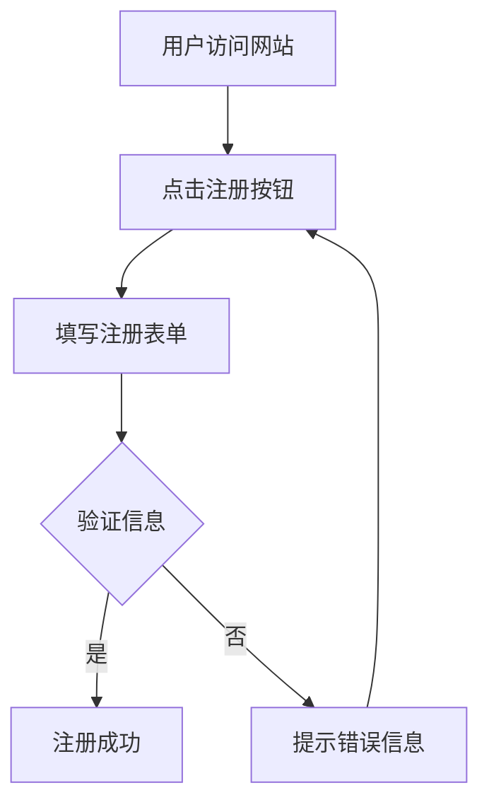
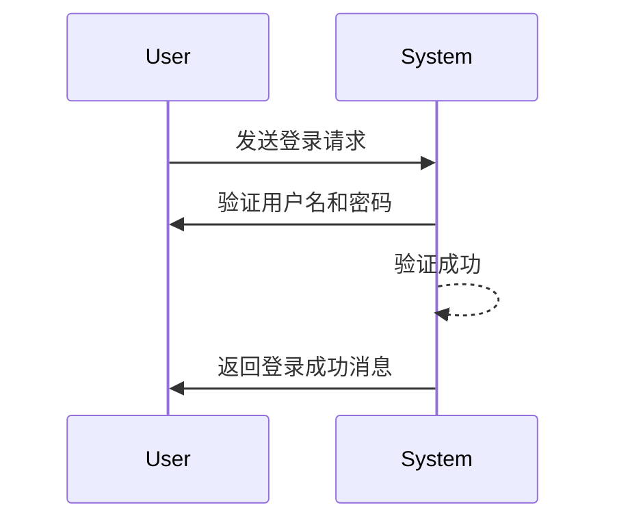
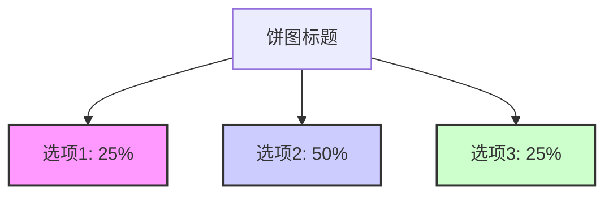

#java
[流程图](https://mermaid-js.github.io/mermaid/#/classDiagram)
当然，以下是一些使用Mermaid的实际案例：

### 1. 流程图案例

**描述一个用户注册流程**



### 2. 序列图案例

**描述一个用户与系统的交互**



### 3. 甘特图案例

**描述一个项目的进度**


```mermaid
gantt
    dateFormat  YYYY-MM-DD
    title       项目进度
    section 项目A
    任务1       :2023-09-06, 10d
    任务2       :after 任务1, 15d
    section 项目B
    任务3       :2023-09-12, 12d
    任务4       :after 任务3, 5d
```
### 4. 类图案例

**描述一个简单的类结构**

注意：Mermaid的原生语法并不直接支持类图，但可以通过流程图或其他方式模拟。以下是一个简化的模拟示例：


```mermaid
graph TB
    classA[ClassA]
    classB[ClassB]
    classA --> classB: 继承
    fieldA1("private fieldA1") --> classA
    methodA1("public methodA1()") --> classA
    methodA2("protected methodA2()") --> classA
```
### 5. 饼图案例（通过模拟）

虽然Mermaid不直接支持饼图，但可以通过流程图或其他方式模拟。以下是一个简化的模拟示例：



注意：这只是一个简化的模拟，并不是真正的饼图。如果你需要绘制饼图，建议使用其他专门的图表库。

这些案例应该能帮助你更好地理解Mermaid的语法和用法。记得查阅Mermaid的官方文档以获取更多详细信息和示例。