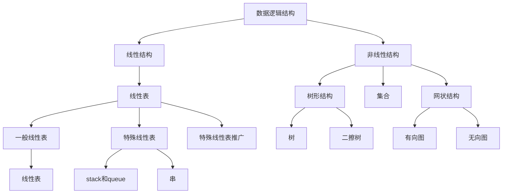

# 数据结构和算法

之前的算法理解有问题，最近关于算法和数据结构有了更新的理解。数据结构和算法。数据结构可以分为数据逻辑结构和数据存储结构。在这个基础上数据逻辑结构有。[[常见算法]]

## 数据逻辑结构

- 队列
- linked list
- 数组
- 树
- stack
- Graph
- 散列表
- 堆

## 散列表

散列表是普通数组概念的推广，在O(1)时间内访问数组的任意元素。散列表不是直接把关键字做为下标，而是根据关键字算出下标。有一个关键问题 **碰撞**

### 碰撞

执行散列函数时，两个关键字可能映射到同一个槽上，此种情形称为发生了碰撞（collision)。

#### 链接法 chaining

使用**链接法**解决碰撞，在链接发中，散列到同一槽的所有元素都放在一个链表中。

> 启发式方法，指人在解决问题时采取的一种根据经验规则进行发现的方法。特点是在解决问题时利用过去的经验，选择已经行之有效的方法，而不是系统的，用确定的步骤去寻求答案。

### 散列法

散列函数经常运用启发式技术来构造好的散列函数。**除法散列**，**乘法散列**==

**除法散列** h(k)=k mod m,除以某个数，然后mod，映射

**乘法散列** h(k)=m(k * A),0<k<1

由于散列算法可能会出现最坏情况，所有都映射到同一个slot,这时候用到了**全域散列**

**全域散列**随机的选择散列函数，使之独立于要存储关键字，保证散列的平均形态。

> 随机化保证没有哪一種输入会始终导致最坏情况发生。所谓物尽天择，上限是可接受的，错误让人无法忍受

**开放寻址法** 所有元素都存放在散列表里，没有链表

## 动态规划

**动态规划**和`分治法`一样通过组合子问题的解解决问题，区别在于动态规划适用于各子问题包含公共的子子问题，动态规划算法对每个子子问题只求解一次，将结果保存在一张表，从而避免每次遇到各个子问题时重新计算答案。

1. 描述最优解的结构
2. 递归定义最优解的值
3. 按自底向上的方式计算最优解的值
4. 由计算出的结果构造一个最优解

适合采用动态规划方法最优化问题中两个要素`最优子结构`，`重叠子问题`

**最优子结构**，如果问题的一个最优解中包含了子问题的最优解，则该问题具有最优子结构。

# 数据结构

## B树

> B树是为磁盘等存储设备设计的平衡查找树，类红黑树，可以降低磁盘I/O操作次数

[[B树]]的节点可以有许多子女，分支因子很大由使用磁盘特性决定。

##	算法研究

这个章节，会用来解决一些算法相关的问题，目前列出算法如下，预期会提供`算法描述`，`代码实现`，`动态图-有就会给`，`算法相关扩展`

- 动态规划算法
- 概率算法
- 排序算法
- 加密算法

## 附录

1. 初等组合学
2. 概率论
3. 离散数学
4. 

## 概率算法

### HyperLogLog

#### 算法描述

#### 动态图

#### 代码实现

### 排序算法

### 排序算法

### 加密算法

## 算法相关扩展

### 似然与极大似然估计

`Likelihood`&`Maximum likelihood`似然与概率，在非正式场合似然和概率（Probability）几乎是一对同义词，但是在统计学中似然和概率却是两个不同的概念.概率是在特定环境下某件事情发生的可能性，也就是结果没有产生之前依据环境所对应的参数来预测某件事情发生的可能性，比如抛硬币，抛之前我们不知道最后是哪一面朝上，但是根据硬币的性质我们可以推测任何一面朝上的可能性均为50%，这个概率只有在抛硬币之前才是有意义的，抛完硬币后的结果便是确定的；而似然刚好相反，是在确定的结果下去推测产生这个结果的可能环境（参数），还是抛硬币的例子，假设我们随机抛掷一枚硬币1,000次，结果500次人头朝上，500次数字朝上（实际情况一般不会这么理想，这里只是举个例子），我们很容易判断这是一枚标准的硬币，两面朝上的概率均为50%，这个过程就是我们运用出现的结果来判断这个事情本身的性质（参数），也就是似然。

结果和参数相互对应的时候，似然和概率在数值上是相等的，如果用 *θ*θ 表示环境对应的参数，*x*x 表示结果，那么概率可以表示为：

*P*(*x*|*θ*)

*p*(*x*|*θ*)p(x|θ) 是条件概率的表示方法，*θ*θ 是前置条件，理解为在 *θ*θ 的前提下，事件 *x*x 发生的概率，相对应的似然可以表示为：

L(*θ*|*x*

可以理解为已知结果为 *x*x ，参数为 *θ*θ (似然函数里 *θ*θ 是变量，这里说的参数和变量是相对与概率而言的)对应的概率，即：L(*θ*|*x*)=*P*(*x*|*θ*)

需要说明的是两者在数值上相等，但是意义并不相同，LL 是关于 *θ*θ 的函数，而 *P*P 则是关于 *x*x 的函数，两者从不同的角度描述一件事情。

#### 例子

以伯努利分布（Bernoulli distribution，又叫做两点分布或0-1分布）为例：

A Graduate Course in Applied Cryptography